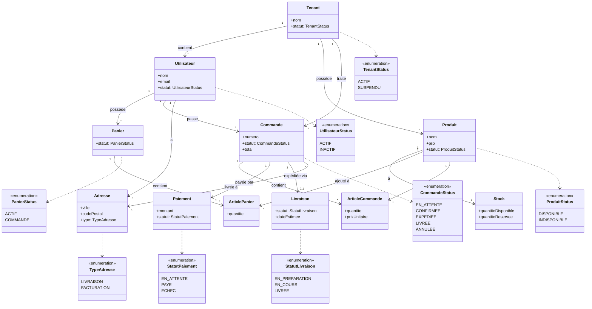

# Diagramme de Classes d'Analyse - Système E-commerce Multi-tenant

## Description Simplifiée

Ce diagramme d'analyse capture les **concepts métier essentiels** du système e-commerce multi-tenant :

### 🏢 **Isolation Multi-tenant**

- **Tenant** : Marchand isolé avec ses propres données
- Chaque entité appartient à un tenant spécifique

### 👤 **Acteurs Principaux**

- **Utilisateur** : Client qui passe des commandes
- **Produit** : Article vendable avec son stock

### 🛒 **Processus de Commande**

- **Panier** → **Commande** → **Paiement** → **Livraison**
- **ArticlePanier** / **ArticleCommande** : Détails des articles
- **Stock** : Gestion des quantités disponibles

### 📍 **Support**

- **Adresse** : Livraison et facturation
- **Statuts** : États des entités métier principales

Ce diagramme épuré se concentre sur l'essentiel métier sans détails techniques prématurés.
