# Diagramme de Classes d'Analyse - Système E-commerce Multi-tenant

```mermaid
classDiagram
    %% ===================================
    %% ENTITÉS MÉTIER ESSENTIELLES
    %% ===================================
    
    class Tenant {
        +nom
        +domaine
        +statut: TenantStatus
        +rating
    }

    class Utilisateur {
        +nom
        +prenom
        +email
        +telephone
        +statut: UtilisateurStatus
    }

    class Produit {
        +nom
        +description
        +prix
        +sku
        +poids
        +statut: ProduitStatus
    }

    class Categorie {
        +nom
        +description
        +parent: Categorie
    }

    class Commande {
        +numero
        +statut: CommandeStatus
        +sousTotal
        +fraisLivraison
        +total
        +methodePaiement
        +notes
    }

    class ArticleCommande {
        +quantite
        +prixUnitaire
        +prixTotal
    }

    class Panier {
        +statut: PanierStatus
        +total
        +nombreArticles
    }

    class ArticlePanier {
        +quantite
        +prixUnitaire
    }

    class Adresse {
        +rue
        +ville
        +codePostal
        +pays
        +type: TypeAdresse
        +nom
        +telephone
    }

    class ZoneLivraison {
        +nom
        +tarif
        +delaiEstime
        +montantMinimum
    }

    class Paiement {
        +montant
        +methodePaiement
        +statut: StatutPaiement
        +idTransaction
    }

    class Livraison {
        +statut: StatutLivraison
        +dateEstimee
        +dateLivraison
        +numeroSuivi
    }

    class Stock {
        +quantiteDisponible
        +quantiteReservee
        +seuilMinimum
    }

    class Role {
        +nom
        +description
    }

    class Permission {
        +nom
        +ressource
        +action
    }

    %% ===================================
    %% ÉNUMÉRATIONS SIMPLIFIÉES
    %% ===================================

    class TenantStatus {
        <<enumeration>>
        ACTIF
        SUSPENDU
    }

    class UtilisateurStatus {
        <<enumeration>>
        ACTIF
        INACTIF
    }

    class ProduitStatus {
        <<enumeration>>
        DISPONIBLE
        INDISPONIBLE
    }

    class CommandeStatus {
        <<enumeration>>
        EN_ATTENTE
        CONFIRMEE
        EXPEDIEE
        LIVREE
        ANNULEE
    }

    class PanierStatus {
        <<enumeration>>
        ACTIF
        COMMANDE
    }

    class StatutPaiement {
        <<enumeration>>
        EN_ATTENTE
        PAYE
        ECHEC
    }

    class StatutLivraison {
        <<enumeration>>
        EN_PREPARATION
        EN_COURS
        LIVREE
    }

    class TypeAdresse {
        <<enumeration>>
        LIVRAISON
        FACTURATION
    }

    %% ===================================
    %% RELATIONS MÉTIER ESSENTIELLES
    %% ===================================

    %% Isolation multi-tenant
    Tenant "1" --> "*" Utilisateur : contient
    Tenant "1" --> "*" Produit : possède
    Tenant "1" --> "*" Commande : traite
    Tenant "1" --> "*" Categorie : organise
    Tenant "1" --> "*" ZoneLivraison : définit
    Tenant "1" --> "*" Role : gère

    %% Cycle de commande principal
    Utilisateur "1" --> "*" Panier : possède
    Utilisateur "1" --> "*" Commande : passe
    Utilisateur "1" --> "*" Adresse : a
    Utilisateur "*" --> "*" Role : a

    %% Gestion des produits
    Produit "1" --> "1" Stock : a
    Produit "1" --> "*" ArticlePanier : ajouté à
    Produit "1" --> "*" ArticleCommande : commandé
    Produit "*" --> "*" Categorie : appartient à
    Categorie "1" --> "*" Categorie : contient

    %% Composition des commandes
    Panier "1" --> "*" ArticlePanier : contient
    Commande "1" --> "*" ArticleCommande : contient
    Commande "1" --> "1" Paiement : payée par
    Commande "1" --> "0..1" Livraison : expédiée via
    Commande "*" --> "1" Adresse : livrée à
    Commande "*" --> "1" ZoneLivraison : livrée dans

    %% Gestion des permissions
    Role "*" --> "*" Permission : possède

    %% Relations géographiques
    Adresse "*" --> "1" ZoneLivraison : située dans

    %% Relations avec énumérations
    Tenant ..> TenantStatus
    Utilisateur ..> UtilisateurStatus
    Produit ..> ProduitStatus
    Commande ..> CommandeStatus
    Panier ..> PanierStatus
    Paiement ..> StatutPaiement
    Livraison ..> StatutLivraison
    Adresse ..> TypeAdresse
```

## Description Simplifiée

Ce diagramme d'analyse capture les **concepts métier essentiels** du système e-commerce multi-tenant :

### 🏢 **Isolation Multi-tenant**

- **Tenant** : Marchand avec domaine, rating et gestion de ses données
- **Role/Permission** : Système de droits d'accès par tenant
- Chaque entité métier appartient à un tenant spécifique

### 👤 **Acteurs et Catalogue**

- **Utilisateur** : Client avec informations complètes de contact
- **Produit** : Article avec description, SKU, poids et statut
- **Categorie** : Organisation hiérarchique des produits
- **Stock** : Gestion des quantités avec seuils et réservations

### 🛒 **Processus de Commande**

- **Panier** → **Commande** → **Paiement** → **Livraison**
- **ArticlePanier** / **ArticleCommande** : Détails avec prix et quantités
- Gestion complète des totaux, frais et méthodes de paiement

### 📍 **Gestion Géographique**

- **Adresse** : Informations complètes avec contact
- **ZoneLivraison** : Tarifs, délais et montants minimum
- Relation géographique entre adresses et zones

### 🔒 **Sécurité et Statuts**

- **Role/Permission** : RBAC granulaire par ressource/action
- **Énumérations** : États métier pour chaque entité principale

Ce diagramme équilibré capture les concepts métier essentiels tout en conservant la richesse nécessaire à la compréhension du domaine.
