# ANNEXE : CAS D'UTILISATION ET DIAGRAMMES DE SÉQUENCE

## Table des matières

1. [Gestion des tenants/commerçants](#1-gestion-des-tenantscommerçants)
2. [Authentification et autorisation](#2-authentification-et-autorisation)
3. [Gestion des utilisateurs](#3-gestion-des-utilisateurs)
4. [Gestion des rôles et permissions](#4-gestion-des-rôles-et-permissions)
5. [Gestion des produits et catalogue](#5-gestion-des-produits-et-catalogue)
6. [Gestion de l'inventaire](#6-gestion-de-linventaire)
7. [Gestion du panier](#7-gestion-du-panier)
8. [Gestion des commandes](#8-gestion-des-commandes)
9. [Gestion des livraisons](#9-gestion-des-livraisons)
10. [Gestion des adresses et zones](#10-gestion-des-adresses-et-zones)
11. [Gestion des notifications](#11-gestion-des-notifications)
12. [Marketplace (vue globale)](#12-marketplace-vue-globale)
13. [Administration système](#13-administration-système)

---

## 1. Gestion des tenants/commerçants

### F-TEN-01 : Créer un nouveau tenant/commerçant
- **Acteurs** : Super-administrateur
- **Priorité** : Haute
- **Préconditions** : Super-administrateur authentifié
- **Scénario nominal** :
  1. Le super-administrateur accède à l'interface de création tenant
  2. Il saisit les informations du commerçant (nom, slug, email, domaine)
  3. Le système vérifie l'unicité du slug et du domaine
  4. Le tenant est créé avec un statut "actif"
  5. Un compte administrateur tenant est automatiquement créé
  6. Le commerçant reçoit ses identifiants par email

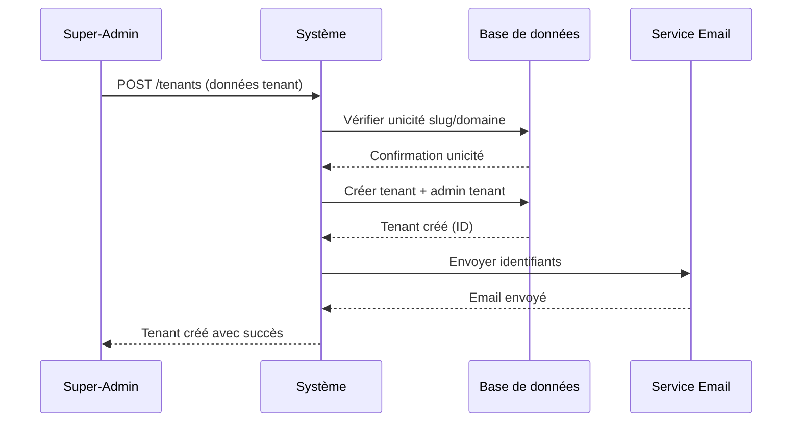
```mermaid
sequenceDiagram
    participant SA as Super-Admin
    participant S as Système
    participant DB as Base de données
    participant EM as Service Email
    
    SA->>S: POST /tenants (données tenant)
    S->>DB: Vérifier unicité slug/domaine
    DB-->>S: Confirmation unicité
    S->>DB: Créer tenant + admin tenant
    DB-->>S: Tenant créé (ID)
    S->>EM: Envoyer identifiants
    EM-->>S: Email envoyé
    S-->>SA: Tenant créé avec succès
```

### F-TEN-02 : Configurer les paramètres du tenant
- **Acteurs** : Administrateur tenant
- **Priorité** : Haute
- **Préconditions** : Administrateur tenant authentifié
- **Scénario nominal** :
  1. L'administrateur accède aux paramètres du tenant
  2. Il modifie les informations (nom commercial, description, logo)
  3. Il configure les paramètres de livraison et paiement
  4. Il sauvegarde les modifications
  5. Le système met à jour les configurations

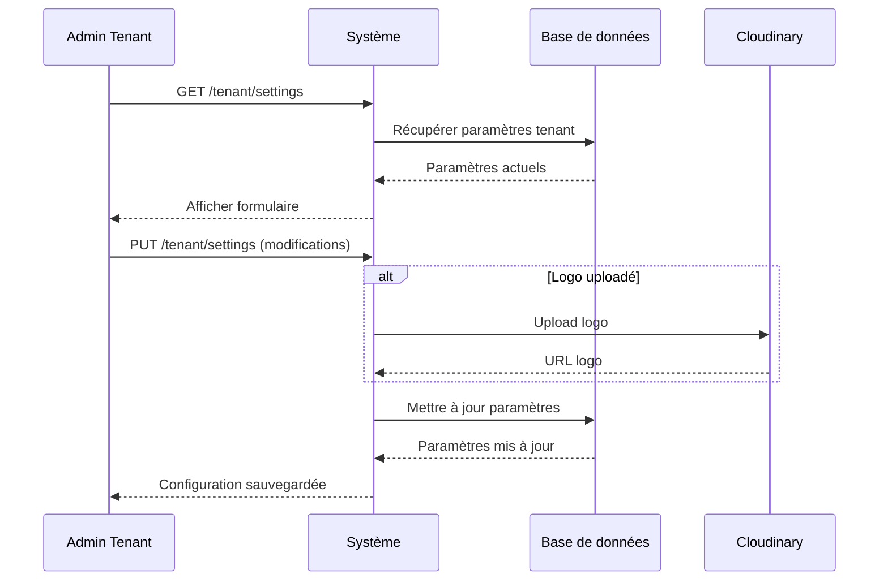
```mermaid
sequenceDiagram
    participant AT as Admin Tenant
    participant S as Système
    participant DB as Base de données
    participant CDN as Cloudinary
    
    AT->>S: GET /tenant/settings
    S->>DB: Récupérer paramètres tenant
    DB-->>S: Paramètres actuels
    S-->>AT: Afficher formulaire
    AT->>S: PUT /tenant/settings (modifications)
    alt Logo uploadé
        S->>CDN: Upload logo
        CDN-->>S: URL logo
    end
    S->>DB: Mettre à jour paramètres
    DB-->>S: Paramètres mis à jour
    S-->>AT: Configuration sauvegardée
```

### F-TEN-03 : Consulter les statistiques du tenant
- **Acteurs** : Administrateur tenant, Gestionnaire
- **Priorité** : Moyenne
- **Préconditions** : Utilisateur authentifié avec permissions analytics
- **Scénario nominal** :
  1. L'utilisateur accède au dashboard analytics
  2. Le système calcule les métriques (ventes, produits, commandes)
  3. Les statistiques sont affichées avec graphiques
  4. L'utilisateur peut filtrer par période
  5. Il peut exporter les données

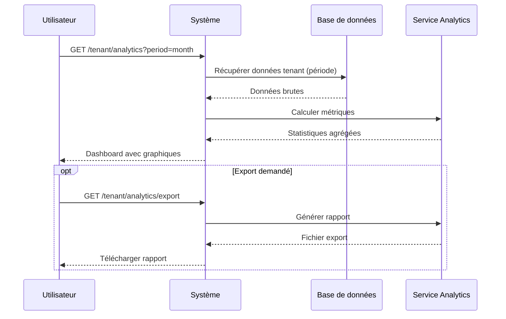
```mermaid
sequenceDiagram
    participant U as Utilisateur
    participant S as Système
    participant DB as Base de données
    participant AN as Service Analytics
    
    U->>S: GET /tenant/analytics?period=month
    S->>DB: Récupérer données tenant (période)
    DB-->>S: Données brutes
    S->>AN: Calculer métriques
    AN-->>S: Statistiques agrégées
    S-->>U: Dashboard avec graphiques
    opt Export demandé
        U->>S: GET /tenant/analytics/export
        S->>AN: Générer rapport
        AN-->>S: Fichier export
        S-->>U: Télécharger rapport
    end
```

### F-TEN-04 : Gérer les membres du tenant
- **Acteurs** : Administrateur tenant
- **Priorité** : Haute
- **Préconditions** : Administrateur tenant authentifié
- **Scénario nominal** :
  1. L'administrateur accède à la gestion des membres
  2. Il consulte la liste des utilisateurs du tenant
  3. Il peut inviter de nouveaux membres avec rôles
  4. Il peut modifier les rôles des membres existants
  5. Il peut désactiver/réactiver des comptes

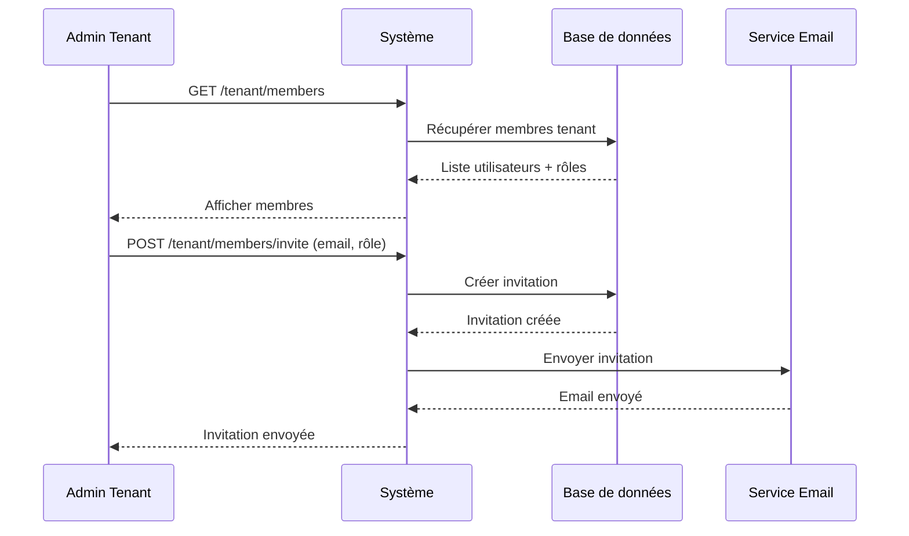
```mermaid
sequenceDiagram
    participant AT as Admin Tenant
    participant S as Système
    participant DB as Base de données
    participant EM as Service Email
    
    AT->>S: GET /tenant/members
    S->>DB: Récupérer membres tenant
    DB-->>S: Liste utilisateurs + rôles
    S-->>AT: Afficher membres
    AT->>S: POST /tenant/members/invite (email, rôle)
    S->>DB: Créer invitation
    DB-->>S: Invitation créée
    S->>EM: Envoyer invitation
    EM-->>S: Email envoyé
    S-->>AT: Invitation envoyée
```

### F-TEN-05 : Suspendre/réactiver un tenant
- **Acteurs** : Super-administrateur
- **Priorité** : Haute
- **Préconditions** : Super-administrateur authentifié
- **Scénario nominal** :
  1. Le super-administrateur consulte la liste des tenants
  2. Il sélectionne un tenant à suspendre/réactiver
  3. Il confirme l'action avec motif
  4. Le système met à jour le statut du tenant
  5. Les membres du tenant sont notifiés

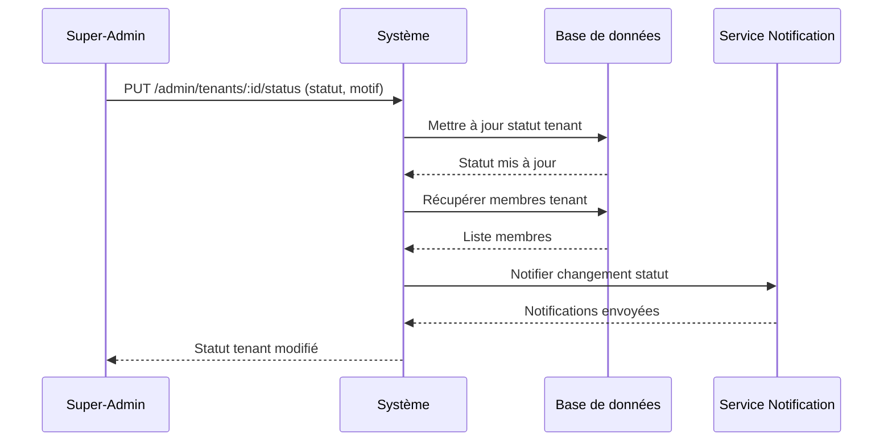
```mermaid
sequenceDiagram
    participant SA as Super-Admin
    participant S as Système
    participant DB as Base de données
    participant NS as Service Notification
    
    SA->>S: PUT /admin/tenants/:id/status (statut, motif)
    S->>DB: Mettre à jour statut tenant
    DB-->>S: Statut mis à jour
    S->>DB: Récupérer membres tenant
    DB-->>S: Liste membres
    S->>NS: Notifier changement statut
    NS-->>S: Notifications envoyées
    S-->>SA: Statut tenant modifié
```

---

## 2. Authentification et autorisation

### F-AUTH-01 : Connexion utilisateur
- **Acteurs** : Tous les utilisateurs
- **Priorité** : Critique
- **Préconditions** : Utilisateur enregistré et actif
- **Scénario nominal** :
  1. L'utilisateur saisit email et mot de passe
  2. Le système vérifie les identifiants
  3. Il vérifie l'appartenance à un tenant actif
  4. Un token JWT est généré avec les permissions
  5. L'utilisateur est redirigé vers son dashboard

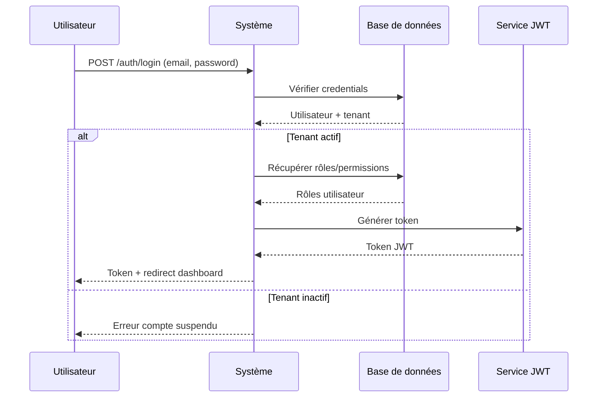
```mermaid
sequenceDiagram
    participant U as Utilisateur
    participant S as Système
    participant DB as Base de données
    participant JWT as Service JWT
    
    U->>S: POST /auth/login (email, password)
    S->>DB: Vérifier credentials
    DB-->>S: Utilisateur + tenant
    alt Tenant actif
        S->>DB: Récupérer rôles/permissions
        DB-->>S: Rôles utilisateur
        S->>JWT: Générer token
        JWT-->>S: Token JWT
        S-->>U: Token + redirect dashboard
    else Tenant inactif
        S-->>U: Erreur compte suspendu
    end
```

### F-AUTH-02 : Inscription nouveau client
- **Acteurs** : Client potentiel
- **Priorité** : Haute
- **Préconditions** : Aucune
- **Scénario nominal** :
  1. Le client accède au formulaire d'inscription
  2. Il saisit ses informations personnelles
  3. Le système vérifie l'unicité de l'email
  4. Un compte client est créé avec le rôle par défaut
  5. Un email de vérification est envoyé

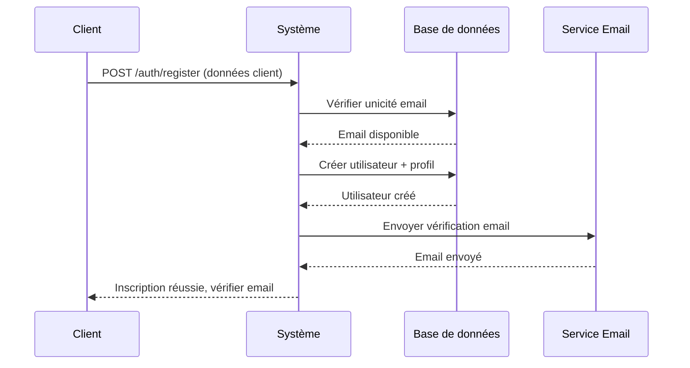
```mermaid
sequenceDiagram
    participant C as Client
    participant S as Système
    participant DB as Base de données
    participant EM as Service Email
    
    C->>S: POST /auth/register (données client)
    S->>DB: Vérifier unicité email
    DB-->>S: Email disponible
    S->>DB: Créer utilisateur + profil
    DB-->>S: Utilisateur créé
    S->>EM: Envoyer vérification email
    EM-->>S: Email envoyé
    S-->>C: Inscription réussie, vérifier email
```

### F-AUTH-03 : Réinitialisation mot de passe
- **Acteurs** : Tous les utilisateurs
- **Priorité** : Moyenne
- **Préconditions** : Utilisateur enregistré
- **Scénario nominal** :
  1. L'utilisateur demande la réinitialisation
  2. Il saisit son email
  3. Le système génère un token de réinitialisation
  4. Un email avec lien est envoyé
  5. L'utilisateur clique et définit un nouveau mot de passe

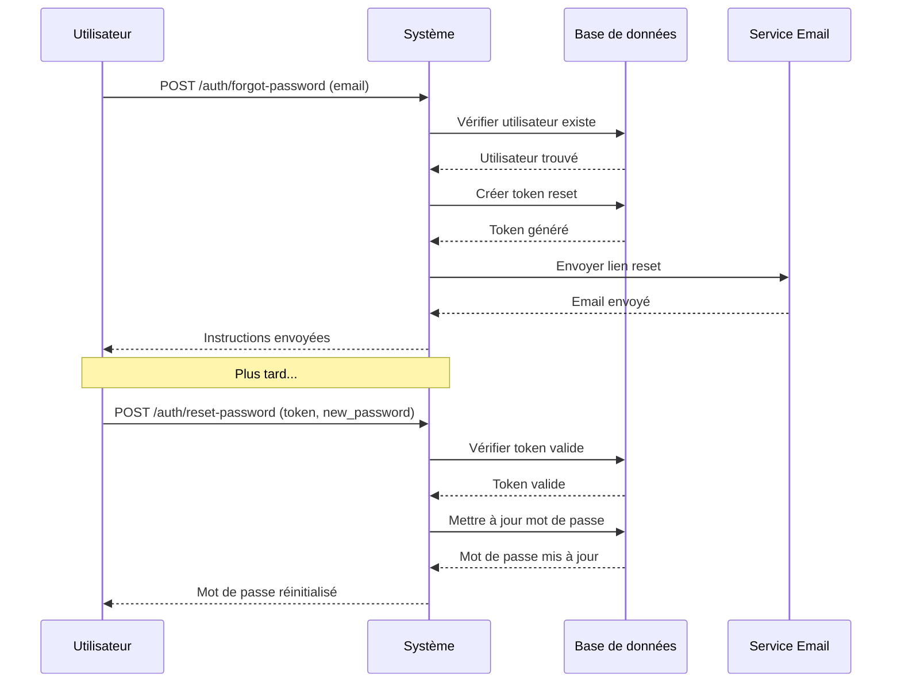
```mermaid
sequenceDiagram
    participant U as Utilisateur
    participant S as Système
    participant DB as Base de données
    participant EM as Service Email
    
    U->>S: POST /auth/forgot-password (email)
    S->>DB: Vérifier utilisateur existe
    DB-->>S: Utilisateur trouvé
    S->>DB: Créer token reset
    DB-->>S: Token généré
    S->>EM: Envoyer lien reset
    EM-->>S: Email envoyé
    S-->>U: Instructions envoyées
    
    Note over U,S: Plus tard...
    U->>S: POST /auth/reset-password (token, new_password)
    S->>DB: Vérifier token valide
    DB-->>S: Token valide
    S->>DB: Mettre à jour mot de passe
    DB-->>S: Mot de passe mis à jour
    S-->>U: Mot de passe réinitialisé
```

### F-AUTH-04 : Déconnexion
- **Acteurs** : Utilisateurs connectés
- **Priorité** : Moyenne
- **Préconditions** : Utilisateur authentifié
- **Scénario nominal** :
  1. L'utilisateur clique sur déconnexion
  2. Le token côté client est supprimé
  3. La session est invalidée
  4. L'utilisateur est redirigé vers l'accueil

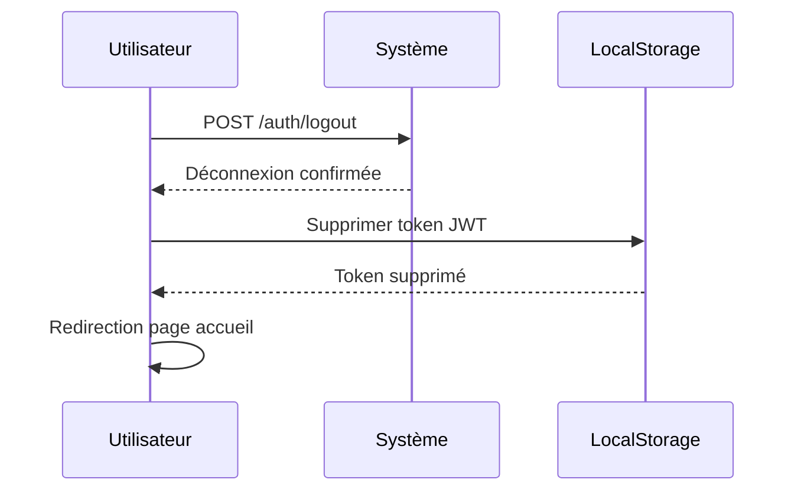
```mermaid
sequenceDiagram
    participant U as Utilisateur
    participant S as Système
    participant LS as LocalStorage
    
    U->>S: POST /auth/logout
    S-->>U: Déconnexion confirmée
    U->>LS: Supprimer token JWT
    LS-->>U: Token supprimé
    U->>U: Redirection page accueil
```

### F-AUTH-05 : Vérification des permissions
- **Acteurs** : Système (processus interne)
- **Priorité** : Critique
- **Préconditions** : Utilisateur authentifié
- **Scénario nominal** :
  1. Une requête protégée est reçue
  2. Le middleware vérifie le token JWT
  3. Il extrait les permissions de l'utilisateur
  4. Il vérifie la permission requise pour l'action
  5. L'accès est autorisé ou refusé

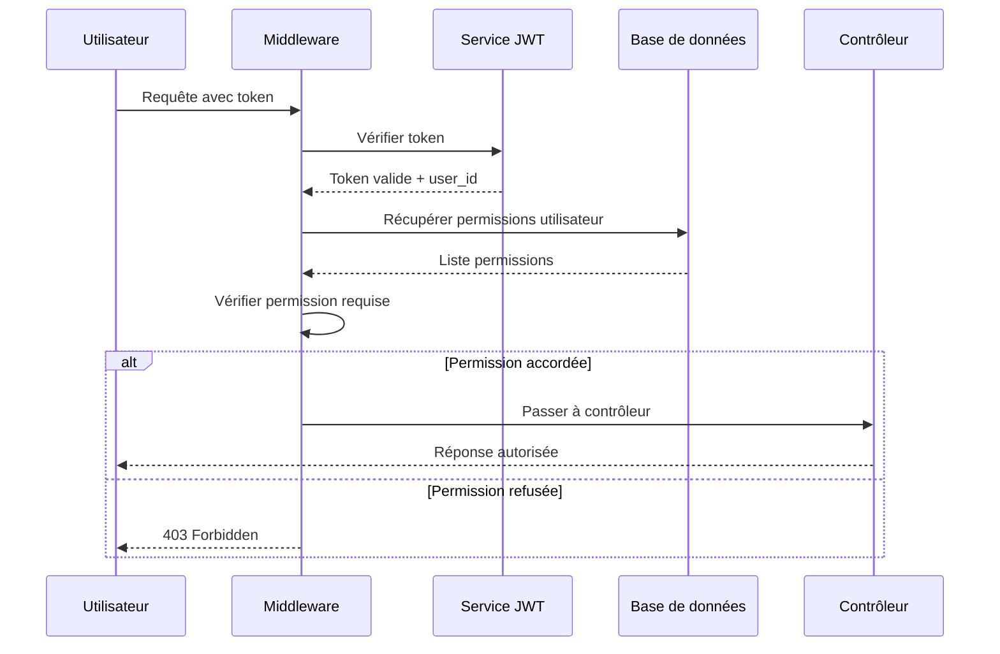
```mermaid
sequenceDiagram
    participant U as Utilisateur
    participant MW as Middleware
    participant JWT as Service JWT
    participant DB as Base de données
    participant C as Contrôleur
    
    U->>MW: Requête avec token
    MW->>JWT: Vérifier token
    JWT-->>MW: Token valide + user_id
    MW->>DB: Récupérer permissions utilisateur
    DB-->>MW: Liste permissions
    MW->>MW: Vérifier permission requise
    alt Permission accordée
        MW->>C: Passer à contrôleur
        C-->>U: Réponse autorisée
    else Permission refusée
        MW-->>U: 403 Forbidden
    end
```

---

## 3. Gestion des utilisateurs

### F-USER-01 : Consulter le profil utilisateur
- **Acteurs** : Tous les utilisateurs
- **Priorité** : Moyenne
- **Préconditions** : Utilisateur authentifié
- **Scénario nominal** :
  1. L'utilisateur accède à son profil
  2. Le système récupère les informations personnelles
  3. Les données du profil sont affichées
  4. L'utilisateur peut consulter ses rôles et permissions

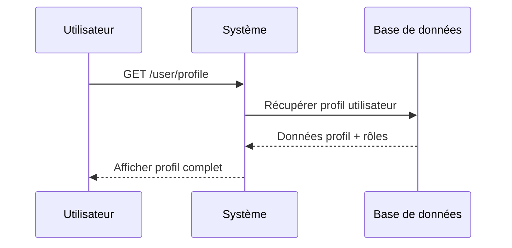
```mermaid
sequenceDiagram
    participant U as Utilisateur
    participant S as Système
    participant DB as Base de données
    
    U->>S: GET /user/profile
    S->>DB: Récupérer profil utilisateur
    DB-->>S: Données profil + rôles
    S-->>U: Afficher profil complet
```

### F-USER-02 : Modifier le profil utilisateur
- **Acteurs** : Tous les utilisateurs
- **Priorité** : Moyenne
- **Préconditions** : Utilisateur authentifié
- **Scénario nominal** :
  1. L'utilisateur modifie ses informations personnelles
  2. Le système valide les nouvelles données
  3. Les modifications sont sauvegardées
  4. Une confirmation est affichée

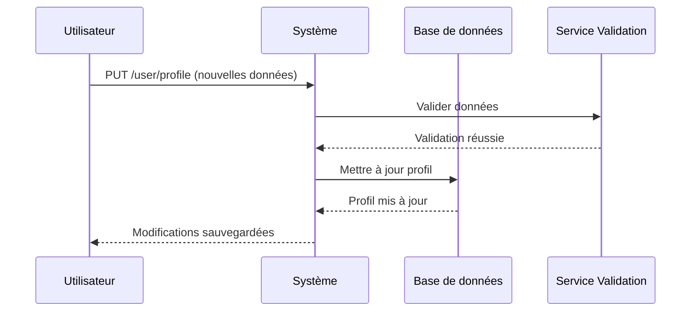
```mermaid
sequenceDiagram
    participant U as Utilisateur
    participant S as Système
    participant DB as Base de données
    participant V as Service Validation
    
    U->>S: PUT /user/profile (nouvelles données)
    S->>V: Valider données
    V-->>S: Validation réussie
    S->>DB: Mettre à jour profil
    DB-->>S: Profil mis à jour
    S-->>U: Modifications sauvegardées
```

### F-USER-03 : Gérer les adresses utilisateur
- **Acteurs** : Clients, Commerçants
- **Priorité** : Haute
- **Préconditions** : Utilisateur authentifié
- **Scénario nominal** :
  1. L'utilisateur accède à ses adresses
  2. Il peut ajouter une nouvelle adresse
  3. Il peut modifier une adresse existante
  4. Il peut définir une adresse par défaut
  5. Il peut supprimer une adresse

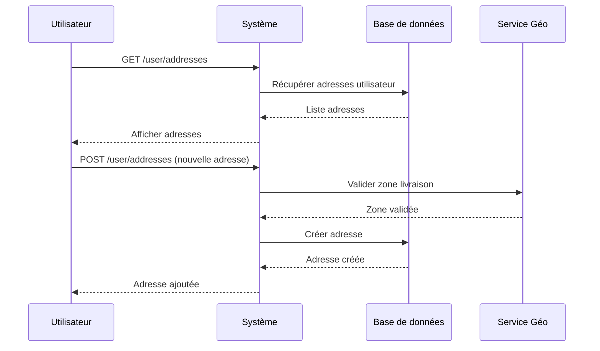
```mermaid
sequenceDiagram
    participant U as Utilisateur
    participant S as Système
    participant DB as Base de données
    participant GS as Service Géo
    
    U->>S: GET /user/addresses
    S->>DB: Récupérer adresses utilisateur
    DB-->>S: Liste adresses
    S-->>U: Afficher adresses
    
    U->>S: POST /user/addresses (nouvelle adresse)
    S->>GS: Valider zone livraison
    GS-->>S: Zone validée
    S->>DB: Créer adresse
    DB-->>S: Adresse créée
    S-->>U: Adresse ajoutée
```

### F-USER-04 : Consulter l'historique des activités
- **Acteurs** : Tous les utilisateurs
- **Priorité** : Faible
- **Préconditions** : Utilisateur authentifié
- **Scénario nominal** :
  1. L'utilisateur accède à son historique
  2. Le système récupère les activités récentes
  3. L'historique est affiché par catégorie
  4. L'utilisateur peut filtrer par date/type

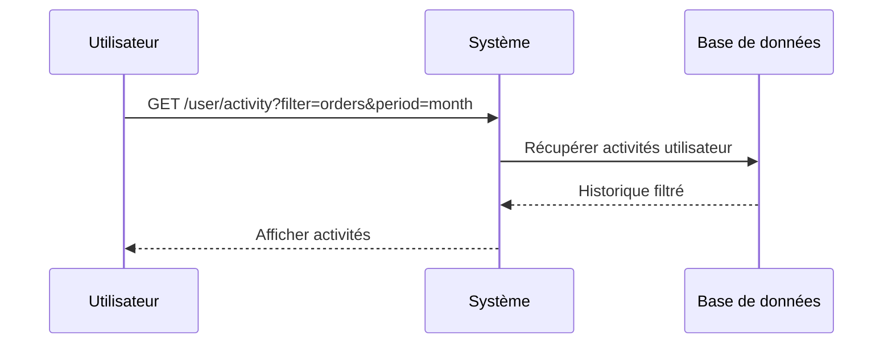
```mermaid
sequenceDiagram
    participant U as Utilisateur
    participant S as Système
    participant DB as Base de données
    
    U->>S: GET /user/activity?filter=orders&period=month
    S->>DB: Récupérer activités utilisateur
    DB-->>S: Historique filtré
    S-->>U: Afficher activités
```

---

## 4. Gestion des rôles et permissions

### F-ROLE-01 : Créer un nouveau rôle
- **Acteurs** : Super-administrateur, Administrateur tenant
- **Priorité** : Moyenne
- **Préconditions** : Utilisateur avec permission de gestion des rôles
- **Scénario nominal** :
  1. L'administrateur accède à la gestion des rôles
  2. Il créé un nouveau rôle avec nom et description
  3. Il sélectionne les permissions à associer
  4. Le rôle est créé et peut être assigné

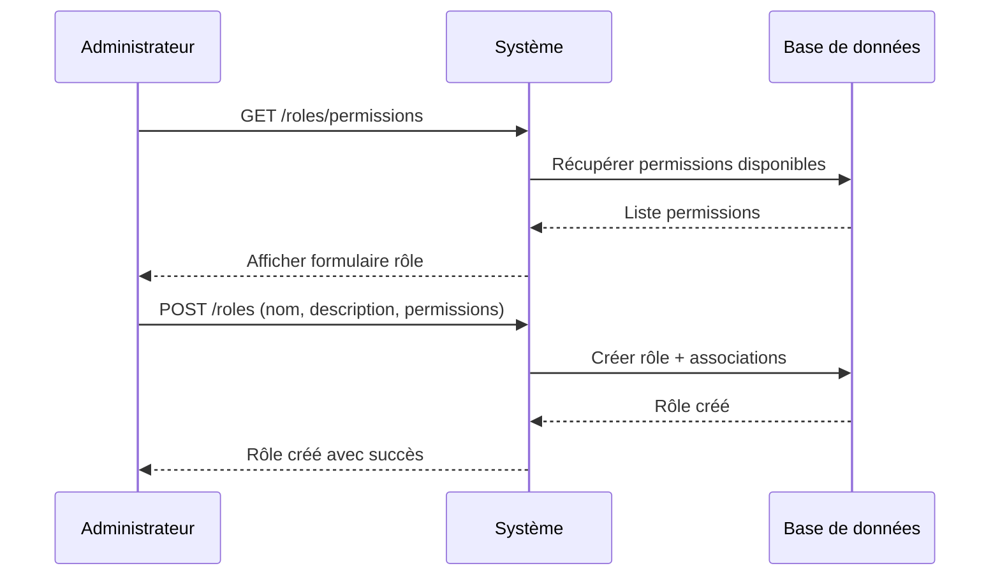
```mermaid
sequenceDiagram
    participant A as Administrateur
    participant S as Système
    participant DB as Base de données
    
    A->>S: GET /roles/permissions
    S->>DB: Récupérer permissions disponibles
    DB-->>S: Liste permissions
    S-->>A: Afficher formulaire rôle
    A->>S: POST /roles (nom, description, permissions)
    S->>DB: Créer rôle + associations
    DB-->>S: Rôle créé
    S-->>A: Rôle créé avec succès
```

### F-ROLE-02 : Assigner un rôle à un utilisateur
- **Acteurs** : Administrateur tenant
- **Priorité** : Haute
- **Préconditions** : Administrateur avec permission de gestion utilisateurs
- **Scénario nominal** :
  1. L'administrateur sélectionne un utilisateur
  2. Il consulte les rôles disponibles
  3. Il assigne un ou plusieurs rôles
  4. Les permissions sont automatiquement accordées

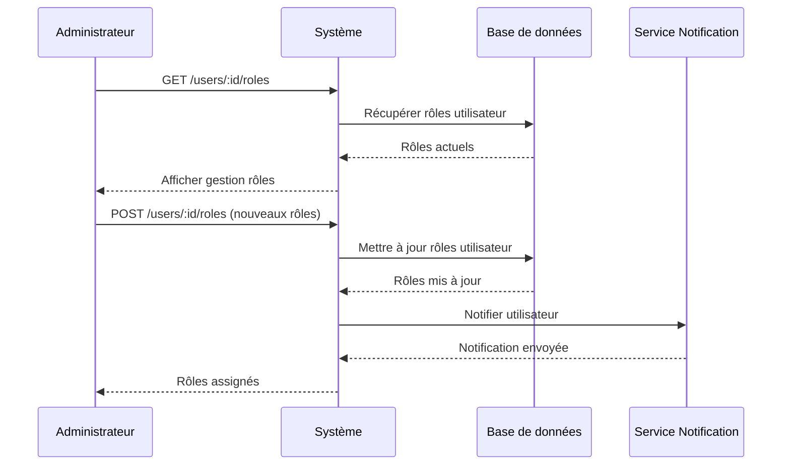
```mermaid
sequenceDiagram
    participant A as Administrateur
    participant S as Système
    participant DB as Base de données
    participant NS as Service Notification
    
    A->>S: GET /users/:id/roles
    S->>DB: Récupérer rôles utilisateur
    DB-->>S: Rôles actuels
    S-->>A: Afficher gestion rôles
    A->>S: POST /users/:id/roles (nouveaux rôles)
    S->>DB: Mettre à jour rôles utilisateur
    DB-->>S: Rôles mis à jour
    S->>NS: Notifier utilisateur
    NS-->>S: Notification envoyée
    S-->>A: Rôles assignés
```

### F-ROLE-03 : Modifier les permissions d'un rôle
- **Acteurs** : Super-administrateur
- **Priorité** : Moyenne
- **Préconditions** : Super-administrateur authentifié
- **Scénario nominal** :
  1. Le super-administrateur sélectionne un rôle
  2. Il modifie les permissions associées
  3. Les changements affectent tous les utilisateurs du rôle
  4. Une notification est envoyée aux utilisateurs impactés

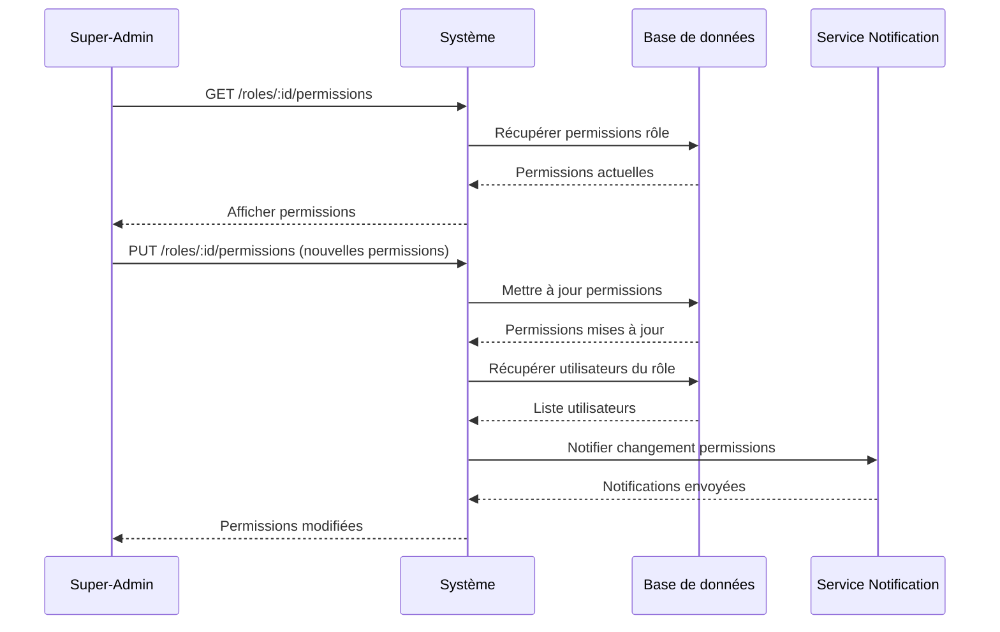
```mermaid
sequenceDiagram
    participant SA as Super-Admin
    participant S as Système
    participant DB as Base de données
    participant NS as Service Notification
    
    SA->>S: GET /roles/:id/permissions
    S->>DB: Récupérer permissions rôle
    DB-->>S: Permissions actuelles
    S-->>SA: Afficher permissions
    SA->>S: PUT /roles/:id/permissions (nouvelles permissions)
    S->>DB: Mettre à jour permissions
    DB-->>S: Permissions mises à jour
    S->>DB: Récupérer utilisateurs du rôle
    DB-->>S: Liste utilisateurs
    S->>NS: Notifier changement permissions
    NS-->>S: Notifications envoyées
    S-->>SA: Permissions modifiées
```

---

## 5. Gestion des produits et catalogue

### F-PROD-01 : Ajouter un nouveau produit
- **Acteurs** : Commerçant, Gestionnaire
- **Priorité** : Critique
- **Préconditions** : Utilisateur authentifié avec permission produits
- **Scénario nominal** :
  1. Le commerçant accède au formulaire d'ajout produit
  2. Il saisit les informations (nom, description, prix, SKU)
  3. Il upload des images du produit
  4. Il sélectionne les catégories
  5. Le produit est créé et ajouté au catalogue

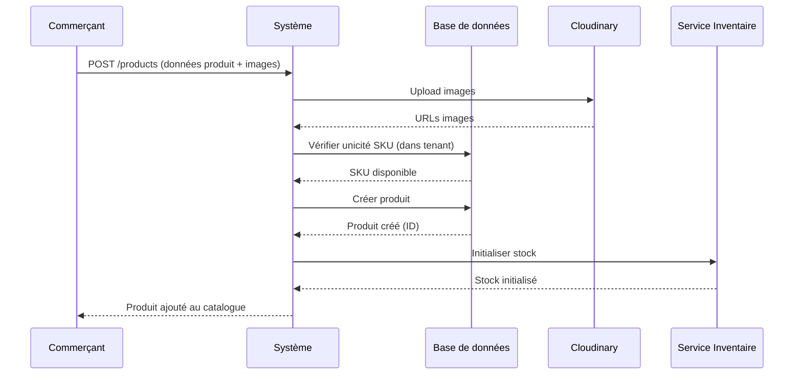
```mermaid
sequenceDiagram
    participant C as Commerçant
    participant S as Système
    participant DB as Base de données
    participant CDN as Cloudinary
    participant IS as Service Inventaire
    
    C->>S: POST /products (données produit + images)
    S->>CDN: Upload images
    CDN-->>S: URLs images
    S->>DB: Vérifier unicité SKU (dans tenant)
    DB-->>S: SKU disponible
    S->>DB: Créer produit
    DB-->>S: Produit créé (ID)
    S->>IS: Initialiser stock
    IS-->>S: Stock initialisé
    S-->>C: Produit ajouté au catalogue
```

### F-PROD-02 : Modifier un produit existant
- **Acteurs** : Commerçant, Gestionnaire
- **Priorité** : Haute
- **Préconditions** : Utilisateur propriétaire du produit
- **Scénario nominal** :
  1. Le commerçant sélectionne un produit à modifier
  2. Il modifie les informations souhaitées
  3. Il peut ajouter/supprimer des images
  4. Les modifications sont sauvegardées
  5. Le catalogue est mis à jour

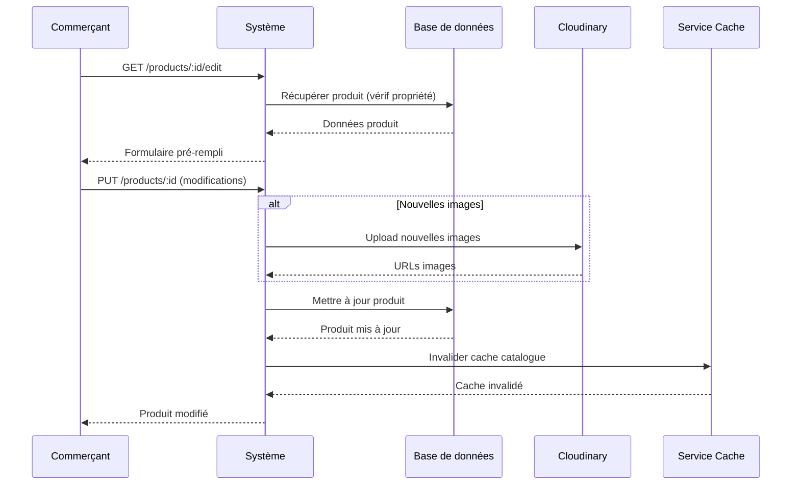
```mermaid
sequenceDiagram
    participant C as Commerçant
    participant S as Système
    participant DB as Base de données
    participant CDN as Cloudinary
    participant CS as Service Cache
    
    C->>S: GET /products/:id/edit
    S->>DB: Récupérer produit (vérif propriété)
    DB-->>S: Données produit
    S-->>C: Formulaire pré-rempli
    C->>S: PUT /products/:id (modifications)
    alt Nouvelles images
        S->>CDN: Upload nouvelles images
        CDN-->>S: URLs images
    end
    S->>DB: Mettre à jour produit
    DB-->>S: Produit mis à jour
    S->>CS: Invalider cache catalogue
    CS-->>S: Cache invalidé
    S-->>C: Produit modifié
```

### F-PROD-03 : Supprimer un produit
- **Acteurs** : Commerçant, Gestionnaire
- **Priorité** : Moyenne
- **Préconditions** : Utilisateur propriétaire, produit sans commandes actives
- **Scénario nominal** :
  1. Le commerçant sélectionne un produit à supprimer
  2. Le système vérifie les contraintes (commandes en cours)
  3. Il confirme la suppression
  4. Le produit est marqué comme supprimé (soft delete)
  5. Il n'apparaît plus dans le catalogue

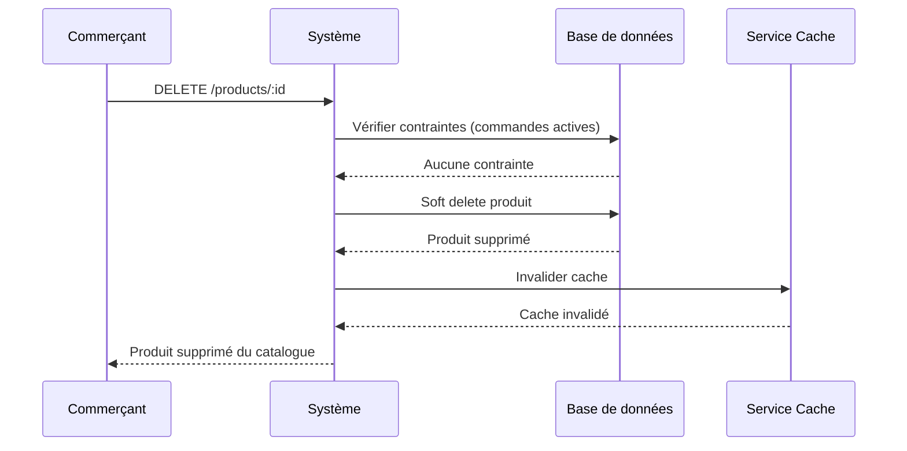
```mermaid
sequenceDiagram
    participant C as Commerçant
    participant S as Système
    participant DB as Base de données
    participant CS as Service Cache
    
    C->>S: DELETE /products/:id
    S->>DB: Vérifier contraintes (commandes actives)
    DB-->>S: Aucune contrainte
    S->>DB: Soft delete produit
    DB-->>S: Produit supprimé
    S->>CS: Invalider cache
    CS-->>S: Cache invalidé
    S-->>C: Produit supprimé du catalogue
```

### F-PROD-04 : Rechercher des produits
- **Acteurs** : Clients, Commerçants
- **Priorité** : Critique
- **Préconditions** : Aucune
- **Scénario nominal** :
  1. L'utilisateur saisit des critères de recherche
  2. Le système recherche dans le catalogue global
  3. Les résultats sont filtrés et triés
  4. L'utilisateur peut affiner sa recherche
  5. Il peut consulter les détails des produits

```mermaid
sequenceDiagram
    participant U as Utilisateur
    participant S as Système
    participant DB as Base de données
    participant ES as Service Recherche
    participant CS as Service Cache
    
    U->>S: GET /products/search?q=smartphone&category=electronique
    S->>CS: Vérifier cache résultats
    CS-->>S: Cache miss
    S->>ES: Recherche full-text
    ES->>DB: Requête avec filtres
    DB-->>ES: Produits correspondants
    ES-->>S: Résultats triés + facettes
    S->>CS: Mettre en cache
    CS-->>S: Résultats cachés
    S-->>U: Afficher résultats + filtres
```

### F-PROD-05 : Gérer les catégories de produits
- **Acteurs** : Administrateur tenant, Gestionnaire
- **Priorité** : Moyenne
- **Préconditions** : Utilisateur avec permission catégories
- **Scénario nominal** :
  1. L'administrateur accède à la gestion des catégories
  2. Il peut créer de nouvelles catégories
  3. Il peut organiser la hiérarchie des catégories
  4. Il peut associer/dissocier des produits
  5. Les modifications sont répercutées sur le catalogue

```mermaid
sequenceDiagram
    participant A as Administrateur
    participant S as Système
    participant DB as Base de données
    participant CS as Service Cache
    
    A->>S: POST /categories (nom, parent_id, description)
    S->>DB: Créer catégorie
    DB-->>S: Catégorie créée
    S->>CS: Invalider cache catégories
    CS-->>S: Cache invalidé
    S-->>A: Catégorie créée
    
    A->>S: POST /products/:id/categories (category_ids)
    S->>DB: Associer produit-catégories
    DB-->>S: Associations créées
    S->>CS: Invalider cache produit
    CS-->>S: Cache invalidé
    S-->>A: Produit associé aux catégories
```

---

## 6. Gestion de l'inventaire

### F-INV-01 : Mettre à jour le stock d'un produit
- **Acteurs** : Commerçant, Gestionnaire
- **Priorité** : Critique
- **Préconditions** : Utilisateur propriétaire du produit
- **Scénario nominal** :
  1. Le commerçant accède à la gestion du stock
  2. Il sélectionne un produit et modifie la quantité
  3. Il ajoute un commentaire sur le mouvement
  4. Le stock est mis à jour en temps réel
  5. Les notifications de stock faible sont vérifiées

```mermaid
sequenceDiagram
    participant C as Commerçant
    participant S as Système
    participant DB as Base de données
    participant NS as Service Notification
    participant WS as WebSocket
    
    C->>S: PUT /inventory/:productId (quantity, comment)
    S->>DB: Mettre à jour stock + créer mouvement
    DB-->>S: Stock mis à jour
    S->>DB: Vérifier seuil stock faible
    DB-->>S: Seuil vérifié
    alt Stock faible
        S->>NS: Créer notification stock faible
        NS-->>S: Notification créée
    end
    S->>WS: Diffuser mise à jour stock
    WS-->>C: Stock mis à jour en temps réel
    S-->>C: Stock modifié avec succès
```

### F-INV-02 : Consulter l'historique des mouvements de stock
- **Acteurs** : Commerçant, Gestionnaire
- **Priorité** : Moyenne
- **Préconditions** : Utilisateur avec permission inventaire
- **Scénario nominal** :
  1. L'utilisateur accède à l'historique des stocks
  2. Il peut filtrer par produit, date, type de mouvement
  3. L'historique détaillé est affiché
  4. Il peut exporter les données pour analyse

```mermaid
sequenceDiagram
    participant U as Utilisateur
    participant S as Système
    participant DB as Base de données
    participant ES as Service Export
    
    U->>S: GET /inventory/movements?product=123&period=month
    S->>DB: Récupérer mouvements filtrés
    DB-->>S: Historique mouvements
    S-->>U: Afficher historique
    
    opt Export demandé
        U->>S: GET /inventory/movements/export
        S->>ES: Générer export CSV
        ES-->>S: Fichier CSV
        S-->>U: Télécharger export
    end
```

---

## 7. Gestion du panier

### F-CART-01 : Ajouter un produit au panier
- **Acteurs** : Clients
- **Priorité** : Critique
- **Préconditions** : Produit disponible en stock
- **Scénario nominal** :
  1. Le client sélectionne un produit et sa quantité
  2. Le système vérifie la disponibilité du stock
  3. Le produit est ajouté au panier
  4. Le panier est mis à jour côté client
  5. Le stock est temporairement réservé

```mermaid
sequenceDiagram
    participant C as Client
    participant S as Système
    participant DB as Base de données
    participant CS as Service Cache
    participant RS as Service Réservation
    
    C->>S: POST /cart/items (productId, quantity)
    S->>DB: Vérifier stock disponible
    DB-->>S: Stock suffisant
    S->>RS: Réserver stock temporairement
    RS-->>S: Stock réservé
    S->>DB: Ajouter/Mettre à jour item panier
    DB-->>S: Panier mis à jour
    S->>CS: Mettre à jour cache panier
    CS-->>S: Cache mis à jour
    S-->>C: Produit ajouté au panier
```

### F-CART-02 : Modifier la quantité d'un produit dans le panier
- **Acteurs** : Clients
- **Priorité** : Haute
- **Préconditions** : Produit présent dans le panier
- **Scénario nominal** :
  1. Le client modifie la quantité d'un produit
  2. Le système vérifie la nouvelle disponibilité
  3. La réservation de stock est ajustée
  4. Le panier est recalculé
  5. Le total est mis à jour

```mermaid
sequenceDiagram
    participant C as Client
    participant S as Système
    participant DB as Base de données
    participant RS as Service Réservation
    participant CS as Service Calcul
    
    C->>S: PUT /cart/items/:id (new_quantity)
    S->>DB: Vérifier stock pour nouvelle quantité
    DB-->>S: Stock vérifié
    S->>RS: Ajuster réservation stock
    RS-->>S: Réservation ajustée
    S->>DB: Mettre à jour quantité panier
    DB-->>S: Panier mis à jour
    S->>CS: Recalculer totaux panier
    CS-->>S: Nouveaux totaux
    S-->>C: Panier mis à jour avec nouveaux totaux
```

### F-CART-03 : Supprimer un produit du panier
- **Acteurs** : Clients
- **Priorité** : Moyenne
- **Préconditions** : Produit présent dans le panier
- **Scénario nominal** :
  1. Le client supprime un produit du panier
  2. La réservation de stock est libérée
  3. L'article est retiré du panier
  4. Les totaux sont recalculés

```mermaid
sequenceDiagram
    participant C as Client
    participant S as Système
    participant DB as Base de données
    participant RS as Service Réservation
    participant CS as Service Calcul
    
    C->>S: DELETE /cart/items/:id
    S->>RS: Libérer réservation stock
    RS-->>S: Stock libéré
    S->>DB: Supprimer item du panier
    DB-->>S: Item supprimé
    S->>CS: Recalculer totaux
    CS-->>S: Nouveaux totaux
    S-->>C: Produit retiré, panier mis à jour
```

### F-CART-04 : Valider le panier et passer commande
- **Acteurs** : Clients
- **Priorité** : Critique
- **Préconditions** : Panier non vide, adresse de livraison définie
- **Scénario nominal** :
  1. Le client valide son panier
  2. Le système sépare les articles par tenant
  3. Des commandes distinctes sont créées
  4. Les réservations deviennent définitives
  5. Les commerçants sont notifiés

```mermaid
sequenceDiagram
    participant C as Client
    participant S as Système
    participant DB as Base de données
    participant OS as Service Commande
    participant NS as Service Notification
    participant PS as Service Paiement
    
    C->>S: POST /cart/checkout (address, payment_method)
    S->>DB: Récupérer panier avec produits
    DB-->>S: Items panier groupés par tenant
    S->>OS: Créer commandes par tenant
    OS->>DB: Créer commandes + order_items
    DB-->>OS: Commandes créées
    OS-->>S: IDs commandes créées
    S->>PS: Initier processus paiement
    PS-->>S: Paiement initié
    S->>NS: Notifier commerçants
    NS-->>S: Notifications envoyées
    S->>DB: Vider panier client
    DB-->>S: Panier vidé
    S-->>C: Commandes créées, redirection paiement
```

---

## 8. Gestion des commandes

### F-ORDER-01 : Consulter les commandes (vue commerçant)
- **Acteurs** : Commerçant, Gestionnaire
- **Priorité** : Critique
- **Préconditions** : Utilisateur authentifié avec permission commandes
- **Scénario nominal** :
  1. Le commerçant accède à ses commandes
  2. La liste des commandes est affichée avec filtres
  3. Il peut voir les détails de chaque commande
  4. Il peut filtrer par statut, date, client

```mermaid
sequenceDiagram
    participant M as Commerçant
    participant S as Système
    participant DB as Base de données
    participant CS as Service Cache
    
    M->>S: GET /orders?status=pending&period=week
    S->>CS: Vérifier cache commandes
    CS-->>S: Cache miss
    S->>DB: Récupérer commandes tenant (filtrées)
    DB-->>S: Liste commandes + détails
    S->>CS: Mettre en cache
    CS-->>S: Données cachées
    S-->>M: Afficher commandes avec pagination
```

### F-ORDER-02 : Modifier le statut d'une commande
- **Acteurs** : Commerçant, Gestionnaire
- **Priorité** : Critique
- **Préconditions** : Commande appartenant au tenant
- **Scénario nominal** :
  1. Le commerçant sélectionne une commande
  2. Il change le statut (confirmée, préparée, expédiée)
  3. Il peut ajouter des commentaires
  4. Le client est automatiquement notifié
  5. L'historique de la commande est mis à jour

```mermaid
sequenceDiagram
    participant M as Commerçant
    participant S as Système
    participant DB as Base de données
    participant NS as Service Notification
    participant WS as WebSocket
    participant DS as Service Livraison
    
    M->>S: PUT /orders/:id/status (new_status, comment)
    S->>DB: Vérifier propriété commande
    DB-->>S: Commande trouvée
    S->>DB: Mettre à jour statut + historique
    DB-->>S: Statut mis à jour
    
    alt Statut = "expédiée"
        S->>DS: Créer mission livraison
        DS-->>S: Livraison créée
    end
    
    S->>NS: Notifier client
    NS-->>S: Notification envoyée
    S->>WS: Diffuser mise à jour temps réel
    WS-->>M: Confirmation temps réel
    S-->>M: Statut commande mis à jour
```

### F-ORDER-03 : Consulter l'historique des commandes (vue client)
- **Acteurs** : Clients
- **Priorité** : Haute
- **Préconditions** : Client authentifié
- **Scénario nominal** :
  1. Le client accède à son historique de commandes
  2. Toutes ses commandes sont listées par date
  3. Il peut voir les détails et le statut de chaque commande
  4. Il peut suivre la livraison en cours

```mermaid
sequenceDiagram
    participant C as Client
    participant S as Système
    participant DB as Base de données
    participant TS as Service Tracking
    
    C->>S: GET /user/orders
    S->>DB: Récupérer commandes client
    DB-->>S: Commandes avec détails
    S-->>C: Afficher historique commandes
    
    C->>S: GET /orders/:id/tracking
    S->>TS: Récupérer info livraison
    TS->>DB: Statut livraison
    DB-->>TS: Détails livraison
    TS-->>S: Info tracking
    S-->>C: Afficher suivi livraison
```

### F-ORDER-04 : Annuler une commande
- **Acteurs** : Clients, Commerçants
- **Priorité** : Moyenne
- **Préconditions** : Commande dans un statut annulable
- **Scénario nominal** :
  1. L'utilisateur demande l'annulation
  2. Le système vérifie si l'annulation est possible
  3. Il demande confirmation avec motif
  4. La commande est annulée
  5. Le stock est libéré et les parties notifiées

```mermaid
sequenceDiagram
    participant U as Utilisateur
    participant S as Système
    participant DB as Base de données
    participant IS as Service Inventaire
    participant NS as Service Notification
    participant PS as Service Paiement
    
    U->>S: PUT /orders/:id/cancel (reason)
    S->>DB: Vérifier statut commande
    DB-->>S: Commande annulable
    S->>DB: Marquer commande annulée
    DB-->>S: Commande annulée
    S->>IS: Libérer stock produits
    IS-->>S: Stock libéré
    
    alt Paiement déjà effectué
        S->>PS: Initier remboursement
        PS-->>S: Remboursement initié
    end
    
    S->>NS: Notifier parties concernées
    NS-->>S: Notifications envoyées
    S-->>U: Commande annulée avec succès
```

---

## 9. Gestion des livraisons

### F-LIV-01 : Créer une mission de livraison
- **Acteurs** : Système (automatique), Gestionnaire
- **Priorité** : Haute
- **Préconditions** : Commande expédiée
- **Scénario nominal** :
  1. Une commande passe au statut "expédiée"
  2. Le système crée automatiquement une mission de livraison
  3. La mission est assignée à un livreur de la zone
  4. Le livreur reçoit une notification
  5. Le client peut suivre sa livraison

```mermaid
sequenceDiagram
    participant S as Système
    participant DB as Base de données
    participant AS as Service Assignation
    participant NS as Service Notification
    participant TS as Service Tracking
    
    Note over S: Commande marquée "expédiée"
    S->>DB: Créer livraison
    DB-->>S: Livraison créée (ID)
    S->>AS: Assigner livreur par zone
    AS->>DB: Trouver livreur disponible
    DB-->>AS: Livreur trouvé
    AS-->>S: Livreur assigné
    S->>DB: Mettre à jour assignation
    DB-->>S: Assignation sauvegardée
    S->>NS: Notifier livreur + client
    NS-->>S: Notifications envoyées
    S->>TS: Activer suivi
    TS-->>S: Suivi activé
```

### F-LIV-02 : Gérer les missions de livraison (vue livreur)
- **Acteurs** : Livreur
- **Priorité** : Haute
- **Préconditions** : Livreur enregistré et actif
- **Scénario nominal** :
  1. Le livreur consulte les livraisons disponibles dans sa zone
  2. Il accepte une mission
  3. Il récupère les détails (adresse, contact)
  4. Après livraison, il confirme avec signature
  5. Le statut de la commande est mis à jour

```mermaid
sequenceDiagram
    participant L as Livreur
    participant S as Système
    participant DB as Base de données
    participant NS as Service Notification
    participant PS as Service Paiement
    
    L->>S: GET /deliveries/available
    S->>DB: Récupérer livraisons zone livreur
    DB-->>S: Missions disponibles
    S-->>L: Afficher missions
    
    L->>S: PUT /deliveries/:id/accept
    S->>DB: Assigner livraison au livreur
    DB-->>S: Livraison assignée
    S-->>L: Mission acceptée, détails livraison
    
    L->>S: PUT /deliveries/:id/complete (signature, photo)
    S->>DB: Marquer livraison terminée
    DB-->>S: Livraison terminée
    
    alt Paiement à la livraison
        S->>PS: Confirmer paiement espèces
        PS-->>S: Paiement confirmé
    end
    
    S->>NS: Notifier client + commerçant
    NS-->>S: Notifications envoyées
    S-->>L: Livraison confirmée
```

### F-LIV-03 : Suivre une livraison en temps réel
- **Acteurs** : Clients, Commerçants
- **Priorité** : Moyenne
- **Préconditions** : Commande en cours de livraison
- **Scénario nominal** :
  1. L'utilisateur accède au suivi de sa commande
  2. La position du livreur est affichée sur une carte
  3. Le temps de livraison estimé est calculé
  4. Les mises à jour sont reçues en temps réel

```mermaid
sequenceDiagram
    participant U as Utilisateur
    participant S as Système
    participant DB as Base de données
    participant GS as Service Géo
    participant WS as WebSocket
    
    U->>S: GET /orders/:id/tracking
    S->>DB: Récupérer info livraison
    DB-->>S: Détails livraison + livreur
    S->>GS: Calculer position/ETA
    GS-->>S: Position + temps estimé
    S-->>U: Afficher carte avec position
    
    Note over WS: Mises à jour temps réel
    WS->>U: Position livreur mise à jour
    WS->>U: Nouveau temps estimé
    WS->>U: Livraison confirmée
```

---

## 10. Gestion des adresses et zones

### F-ZONE-01 : Configurer les zones de livraison
- **Acteurs** : Administrateur tenant, Gestionnaire
- **Priorité** : Haute
- **Préconditions** : Utilisateur avec permission zones
- **Scénario nominal** :
  1. L'administrateur accède à la configuration des zones
  2. Il peut créer de nouvelles zones géographiques
  3. Il définit les tarifs de livraison par zone
  4. Il peut activer/désactiver des zones
  5. Les modifications sont appliquées au catalogue

```mermaid
sequenceDiagram
    participant A as Administrateur
    participant S as Système
    participant DB as Base de données
    participant GS as Service Géo
    participant CS as Service Cache
    
    A->>S: POST /delivery-zones (nom, polygon, tarif)
    S->>GS: Valider coordonnées polygon
    GS-->>S: Polygon valide
    S->>DB: Créer zone livraison
    DB-->>S: Zone créée
    S->>CS: Invalider cache zones
    CS-->>S: Cache invalidé
    S-->>A: Zone créée avec succès
```

### F-ZONE-02 : Valider une adresse de livraison
- **Acteurs** : Système (automatique)
- **Priorité** : Critique
- **Préconditions** : Adresse fournie par le client
- **Scénario nominal** :
  1. Une adresse est saisie lors d'une commande
  2. Le système géolocalise l'adresse
  3. Il vérifie si l'adresse est dans une zone couverte
  4. Il calcule les frais de livraison
  5. Il confirme la disponibilité de livraison

```mermaid
sequenceDiagram
    participant C as Client
    participant S as Système
    participant GS as Service Géo
    participant DB as Base de données
    participant CS as Service Calcul
    
    C->>S: POST /addresses/validate (adresse)
    S->>GS: Géocoder adresse
    GS-->>S: Coordonnées GPS
    S->>DB: Vérifier zones couvertes
    DB-->>S: Zone trouvée
    S->>CS: Calculer frais livraison
    CS-->>S: Tarif calculé
    S-->>C: Adresse valide + frais livraison
```

---

## 11. Gestion des notifications

### F-NOTIF-01 : Envoyer des notifications en temps réel
- **Acteurs** : Système (automatique)
- **Priorité** : Haute
- **Préconditions** : Événement déclencheur
- **Scénario nominal** :
  1. Un événement important se produit (commande, livraison)
  2. Le système identifie les destinataires concernés
  3. Des notifications sont créées en base
  4. Elles sont envoyées via WebSocket en temps réel
  5. Les utilisateurs reçoivent les notifications instantanément

```mermaid
sequenceDiagram
    participant E as Événement
    participant NS as Service Notification
    participant DB as Base de données
    participant WS as WebSocket
    participant U as Utilisateur
    
    E->>NS: Déclencher notification (type, data)
    NS->>DB: Identifier destinataires
    DB-->>NS: Liste utilisateurs concernés
    NS->>DB: Créer notifications
    DB-->>NS: Notifications créées
    NS->>WS: Diffuser en temps réel
    WS-->>U: Notification reçue
    U->>WS: Marquer comme lue
    WS->>NS: Notification lue
    NS->>DB: Mettre à jour statut
    DB-->>NS: Statut mis à jour
```

### F-NOTIF-02 : Consulter l'historique des notifications
- **Acteurs** : Tous les utilisateurs
- **Priorité** : Moyenne
- **Préconditions** : Utilisateur authentifié
- **Scénario nominal** :
  1. L'utilisateur accède à ses notifications
  2. La liste des notifications est affichée par date
  3. Il peut filtrer par type ou statut
  4. Il peut marquer comme lues ou supprimer

```mermaid
sequenceDiagram
    participant U as Utilisateur
    participant S as Système
    participant DB as Base de données
    
    U->>S: GET /notifications?unread=true
    S->>DB: Récupérer notifications utilisateur
    DB-->>S: Liste notifications filtrées
    S-->>U: Afficher notifications
    
    U->>S: PUT /notifications/:id/read
    S->>DB: Marquer notification lue
    DB-->>S: Notification mise à jour
    S-->>U: Notification marquée lue
```

### F-NOTIF-03 : Configurer les préférences de notification
- **Acteurs** : Tous les utilisateurs
- **Priorité** : Faible
- **Préconditions** : Utilisateur authentifié
- **Scénario nominal** :
  1. L'utilisateur accède à ses préférences
  2. Il peut activer/désactiver les types de notifications
  3. Il peut choisir les canaux (email, push, SMS)
  4. Les préférences sont sauvegardées

```mermaid
sequenceDiagram
    participant U as Utilisateur
    participant S as Système
    participant DB as Base de données
    
    U->>S: GET /user/notification-preferences
    S->>DB: Récupérer préférences
    DB-->>S: Préférences actuelles
    S-->>U: Afficher formulaire préférences
    
    U->>S: PUT /user/notification-preferences (nouvelles préfs)
    S->>DB: Mettre à jour préférences
    DB-->>S: Préférences sauvegardées
    S-->>U: Préférences mises à jour
```

---

## 12. Marketplace (vue globale)

### F-MARK-01 : Navigation globale de la marketplace
- **Acteurs** : Visiteurs, Clients
- **Priorité** : Critique
- **Préconditions** : Aucune
- **Scénario nominal** :
  1. L'utilisateur accède à la page d'accueil
  2. Il peut parcourir tous les produits de tous les commerçants
  3. Il peut filtrer par commerçant, catégorie, prix
  4. Il peut comparer les produits de différents commerçants
  5. Il peut basculer vers l'espace d'un commerçant spécifique

```mermaid
sequenceDiagram
    participant V as Visiteur
    participant S as Système
    participant DB as Base de données
    participant CS as Service Cache
    participant FS as Service Filtres
    
    V->>S: GET /marketplace
    S->>CS: Vérifier cache accueil
    CS-->>S: Cache hit
    S-->>V: Afficher page d'accueil
    
    V->>S: GET /marketplace/products?category=electronique&price_max=50000
    S->>FS: Appliquer filtres
    FS->>DB: Requête cross-tenant filtrée
    DB-->>FS: Produits correspondants
    FS-->>S: Résultats + facettes
    S-->>V: Afficher produits filtrés
```

### F-MARK-02 : Comparaison de produits cross-tenant
- **Acteurs** : Clients potentiels
- **Priorité** : Moyenne
- **Préconditions** : Plusieurs produits similaires disponibles
- **Scénario nominal** :
  1. Le client sélectionne des produits à comparer
  2. Le système affiche un tableau comparatif
  3. Les caractéristiques sont alignées par attribut
  4. Les prix et disponibilités sont mis en évidence
  5. Le client peut ajouter au panier depuis la comparaison

```mermaid
sequenceDiagram
    participant C as Client
    participant S as Système
    participant DB as Base de données
    participant CS as Service Comparaison
    
    C->>S: POST /marketplace/compare (product_ids)
    S->>DB: Récupérer détails produits
    DB-->>S: Produits avec attributs
    S->>CS: Structurer comparaison
    CS-->>S: Tableau comparatif
    S-->>C: Afficher comparaison
    
    C->>S: POST /cart/items (product_id, quantity)
    Note over S: Réutilise F-CART-01
    S-->>C: Produit ajouté au panier
```

---

## 13. Administration système

### F-ADMIN-01 : Monitoring global de la plateforme
- **Acteurs** : Super-administrateur
- **Priorité** : Haute
- **Préconditions** : Super-administrateur authentifié
- **Scénario nominal** :
  1. Le super-administrateur accède au dashboard global
  2. Les métriques système sont affichées (tenants, utilisateurs, commandes)
  3. Il peut consulter les logs et événements
  4. Il peut identifier les problèmes de performance
  5. Il peut prendre des actions correctives

```mermaid
sequenceDiagram
    participant SA as Super-Admin
    participant S as Système
    participant DB as Base de données
    participant MS as Service Monitoring
    participant LS as Service Logs
    
    SA->>S: GET /admin/dashboard
    S->>DB: Agréger métriques globales
    DB-->>S: Statistiques système
    S->>MS: Récupérer métriques performance
    MS-->>S: Données performance
    S->>LS: Récupérer logs récents
    LS-->>S: Logs système
    S-->>SA: Dashboard administrateur complet
```

### F-ADMIN-02 : Gestion des contenus et modération
- **Acteurs** : Super-administrateur, Modérateur
- **Priorité** : Moyenne
- **Préconditions** : Utilisateur avec permission modération
- **Scénario nominal** :
  1. Le modérateur consulte les contenus signalés
  2. Il peut examiner les produits, commentaires, commerçants
  3. Il peut approuver, rejeter ou demander des modifications
  4. Les parties concernées sont notifiées des décisions
  5. Un historique des modérations est conservé

```mermaid
sequenceDiagram
    participant M as Modérateur
    participant S as Système
    participant DB as Base de données
    participant NS as Service Notification
    
    M->>S: GET /admin/moderation/pending
    S->>DB: Récupérer contenus à modérer
    DB-->>S: Liste contenus signalés
    S-->>M: Afficher queue modération
    
    M->>S: PUT /admin/moderation/:id/approve (decision, comment)
    S->>DB: Mettre à jour statut contenu
    DB-->>S: Statut mis à jour
    S->>DB: Enregistrer action modération
    DB-->>S: Action enregistrée
    S->>NS: Notifier auteur contenu
    NS-->>S: Notification envoyée
    S-->>M: Décision enregistrée
```

---

## Conclusion

Ce document recense **25 cas d'utilisation principaux** couvrant l'ensemble des fonctionnalités de la plateforme e-commerce multi-tenant. Chaque cas d'usage est accompagné de son diagramme de séquence système détaillant les interactions entre les acteurs, le système et les services internes.

L'architecture présentée illustre la complexité d'une plateforme marketplace moderne avec :
- **Isolation multi-tenant rigoureuse**
- **Gestion complète du cycle e-commerce**
- **Notifications temps réel**
- **Système de permissions granulaire**
- **Services géographiques intégrés**

Ces diagrammes constituent la base technique pour l'implémentation et la validation du système développé durant le stage.