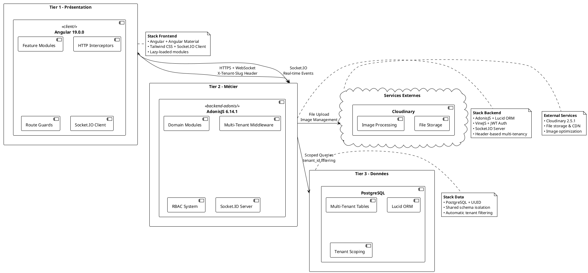
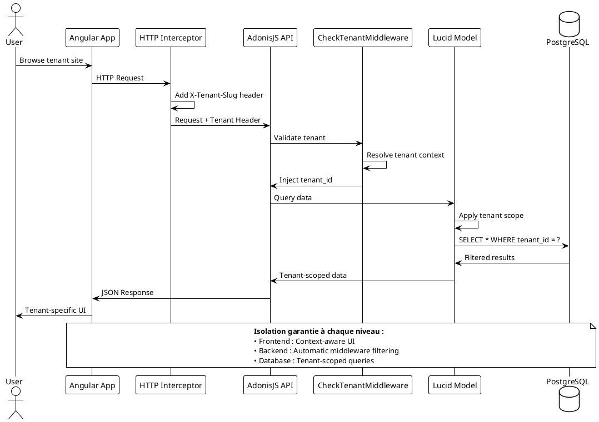

# Architecture 3-Tiers - Diagramme de Packages

## Vue d'ensemble de l'architecture

```plantuml
@startuml Architecture-3-Tiers-Multi-Tenant
!theme plain
skinparam packageStyle rectangle

package "Tier 1 - Présentation" as Tier1 {
  component "Angular 19.0.0" <<client/>> {
    [Feature Modules]
    [HTTP Interceptors]
    [Route Guards]
    [Socket.IO Client]
  }
}

package "Tier 2 - Métier" as Tier2 {
  component "AdonisJS 6.14.1" <<backend-adonis/>> {
    [Domain Modules]
    [Multi-Tenant Middleware]
    [RBAC System]
    [Socket.IO Server]
  }
}

package "Tier 3 - Données" as Tier3 {
  component "PostgreSQL" {
    [Multi-Tenant Tables]
    [Lucid ORM]
    [Tenant Scoping]
  }
}

cloud "Services Externes" as External {
  component "Cloudinary" {
    [File Storage]
    [Image Processing]
  }
}

Tier1 -down-> Tier2 : "HTTPS + WebSocket\nX-Tenant-Slug Header"
Tier2 -down-> Tier3 : "Scoped Queries\ntenant_id filtering"
Tier2 -right-> External : "File Upload\nImage Management"

' Real-time communication
Tier1 <--> Tier2 : "Socket.IO\nReal-time Events"

note right of Tier1
  **Stack Frontend**
  • Angular + Angular Material
  • Tailwind CSS + Socket.IO Client
  • Lazy-loaded modules
end note

note right of Tier2
  **Stack Backend**
  • AdonisJS + Lucid ORM
  • VineJS + JWT Auth
  • Socket.IO Server
  • Header-based multi-tenancy
end note

note right of Tier3
  **Stack Data**
  • PostgreSQL + UUID
  • Shared schema isolation
  • Automatic tenant filtering
end note

note right of External
  **External Services**
  • Cloudinary 2.5.1
  • File storage & CDN
  • Image optimization
end note

@enduml
```

## Flux Multi-Tenant

```plantuml
@startuml Multi-Tenant-Flow
!theme plain

actor "User" as User
participant "Angular App" as Frontend
participant "HTTP Interceptor" as Interceptor
participant "AdonisJS API" as Backend
participant "CheckTenantMiddleware" as Middleware
participant "Lucid Model" as Model
database "PostgreSQL" as DB

User -> Frontend : Browse tenant site
Frontend -> Interceptor : HTTP Request
Interceptor -> Interceptor : Add X-Tenant-Slug header
Interceptor -> Backend : Request + Tenant Header

Backend -> Middleware : Validate tenant
Middleware -> Middleware : Resolve tenant context
Middleware -> Backend : Inject tenant_id

Backend -> Model : Query data
Model -> Model : Apply tenant scope
Model -> DB : SELECT * WHERE tenant_id = ?
DB -> Model : Filtered results
Model -> Backend : Tenant-scoped data
Backend -> Frontend : JSON Response
Frontend -> User : Tenant-specific UI

note over Frontend, DB
  **Isolation garantie à chaque niveau :**
  • Frontend : Context-aware UI
  • Backend : Automatic middleware filtering  
  • Database : Tenant-scoped queries
end note

@enduml
```

## Architecture des Modules

```plantuml
@startuml Module-Architecture
!theme plain

package "Feature Module Pattern" {
  package "auth/" {
    [AuthController]
    [AuthService] 
    [User Model]
    [AuthValidator]
    [auth.routes]
  }
  
  package "product/" {
    [ProductController]
    [ProductService]
    [Product Model]
    [ProductValidator] 
    [product.routes]
  }
  
  package "tenant/" {
    [TenantController]
    [TenantService]
    [Tenant Model]
    [TenantValidator]
    [tenant.routes]
  }
}

package "Shared Infrastructure" {
  [CheckTenantMiddleware]
  [BaseModel with Scoping]
  [RBAC Guards]
  [Socket.IO Service]
}

AuthController -> AuthService
AuthService -> "User Model"
"User Model" -> "BaseModel with Scoping"

ProductController -> ProductService  
ProductService -> "Product Model"
"Product Model" -> "BaseModel with Scoping"

TenantController -> TenantService
TenantService -> "Tenant Model" 
"Tenant Model" -> "BaseModel with Scoping"

"BaseModel with Scoping" -> CheckTenantMiddleware : "Auto tenant filtering"

note as N1
  **Chaque module suit le pattern :**
  Controller → Service → Model → Database
  
  **Isolation multi-tenant automatique :**
  • Middleware injecte tenant_id
  • BaseModel applique scoping
  • Toutes les queries sont filtrées
end note

@enduml
```