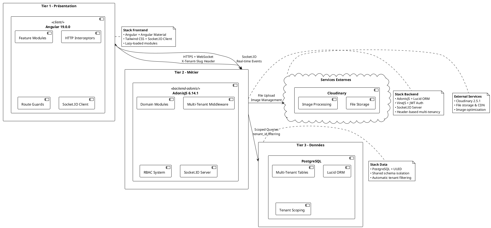

# 3.1 Architecture générale

## 3.1.1 Architecture globale - Modèle 3-tiers

L'architecture de la plateforme adopte une approche 3-tiers modulaire basée sur le Domain-Driven Design avec des services externes intégrés. Cette approche combine les avantages d'un déploiement structuré avec la modularité et l'évolutivité des architectures modernes.

### Vue d'ensemble architecturale

### Principe de l'architecture 3-tiers

Cette architecture respecte le principe de séparation des préoccupations avec trois niveaux distincts plus des services externes :

- **Tier 1 - Présentation** : Interface Angular avec modules lazy-loaded et communication temps réel
- **Tier 2 - Métier** : API AdonisJS avec modules domain-driven et middleware multi-tenant
- **Tier 3 - Données** : Base PostgreSQL avec isolation automatique par tenant
- **Services Externes** : Cloudinary pour stockage et traitement d'images

Chaque tier communique de manière contrôlée, garantissant une faible couplage et une haute cohésion.

## 3.1.2 Tier 1 - Couche de Présentation (client/)

Application Angular 19.0.0 avec architecture modulaire feature-based et communication temps réel.

### Architecture et fonctionnalités clés

- **Modules lazy-loaded** : auth/, marketplace/, dashboard/, products/, users/, orders/, etc.
- **Multi-tenant UI** : Intercepteur automatique `X-Tenant-Slug` + menus dynamiques
- **Communication temps réel** : Socket.IO Client pour notifications live
- **Protection des routes** : Guards d'authentification et permissions RBAC
- **Layouts adaptatifs** : Interface admin et marketplace public séparées

### Stack technique

- **Angular 19.0.0** + TypeScript + Angular Material 19.0.1
- **Styling** : SASS + Tailwind CSS 3.4.15  
- **Communication** : HTTP Client + Socket.IO Client 4.8.1
- **Testing** : Jasmine + Karma

## 3.1.3 Tier 2 - Couche Métier (backend-adonis/)

API AdonisJS 6.14.1 avec architecture modulaire domain-driven et isolation multi-tenant complète.

### Architecture et fonctionnalités clés

- **Modules domain-driven** : auth/, user/, tenant/, product/, order/, cart/, delivery/, etc.
- **Multi-tenant header-based** : Middleware `CheckTenantMiddleware` + scoping automatique
- **RBAC complet** : Système de rôles et permissions avec ressources
- **Communication temps réel** : Socket.IO Server pour notifications live
- **Services externes** : Intégration Cloudinary pour stockage fichiers
- **E-commerce core** : Catalogue, inventaire, commandes, paiements

### Isolation multi-tenant

- **Header `X-Tenant-Slug`** : Résolution automatique du contexte tenant
- **Model scoping** : Filtrage transparent par `tenant_id` sur tous les modèles
- **Permission guards** : Vérification tenant-aware des autorisations

### Stack technique

- **AdonisJS 6.14.1** + TypeScript + Lucid ORM
- **Validation** : VineJS 2.1.0 + AdonisJS Auth 9.2.4 (JWT)
- **Services** : AdonisJS Mail 9.2.2 + Cloudinary 2.5.1
- **Communication** : Socket.IO 4.8.1 + HTTP REST API
- **Testing** : Japa framework

## 3.1.4 Tier 3 - Couche de Données (PostgreSQL)

Base de données PostgreSQL avec architecture multi-tenant "shared database, shared schema" et isolation logique par tenant_id.

### Architecture et fonctionnalités clés

- **Tables multi-tenant** : Toutes les tables incluent une colonne `tenant_id`
- **Isolation automatique** : Global scopes Lucid filtrent par tenant_id
- **Schéma relationnel** : Tables auth, e-commerce, delivery, notifications avec contraintes FK
- **Performance optimisée** : Index composites `(tenant_id, ...)` + connection pooling
- **Data integrity** : Contraintes referentielles + soft deletes + timestamps

### Tables principales implémentées

- **Multi-tenancy** : tenants, user_tenants
- **Auth & RBAC** : users, roles, permissions, resources
- **E-commerce** : products, categories, inventory, carts, orders, payments
- **Delivery** : addresses, delivery_zones, deliveries, delivery_people
- **System** : notifications, menu_items

### Stack technique

- **PostgreSQL** + Lucid ORM + AdonisJS Migrations
- **Extensions** : uuid-ossp pour identifiants uniques
- **Indexation** : Index composites pour performance multi-tenant
- **Connection management** : Pool de connexions configuré
