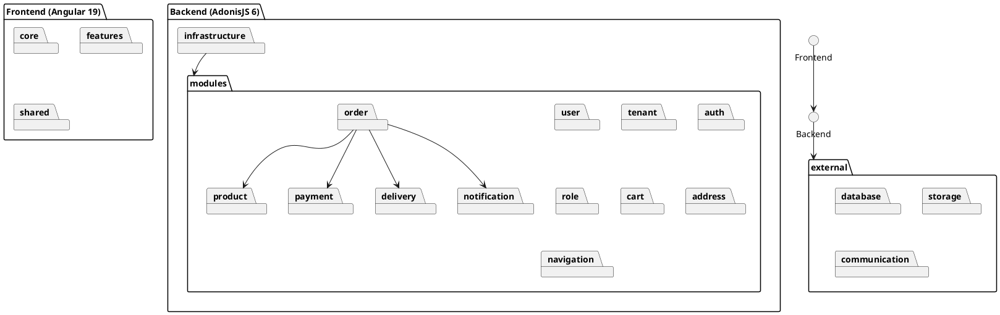
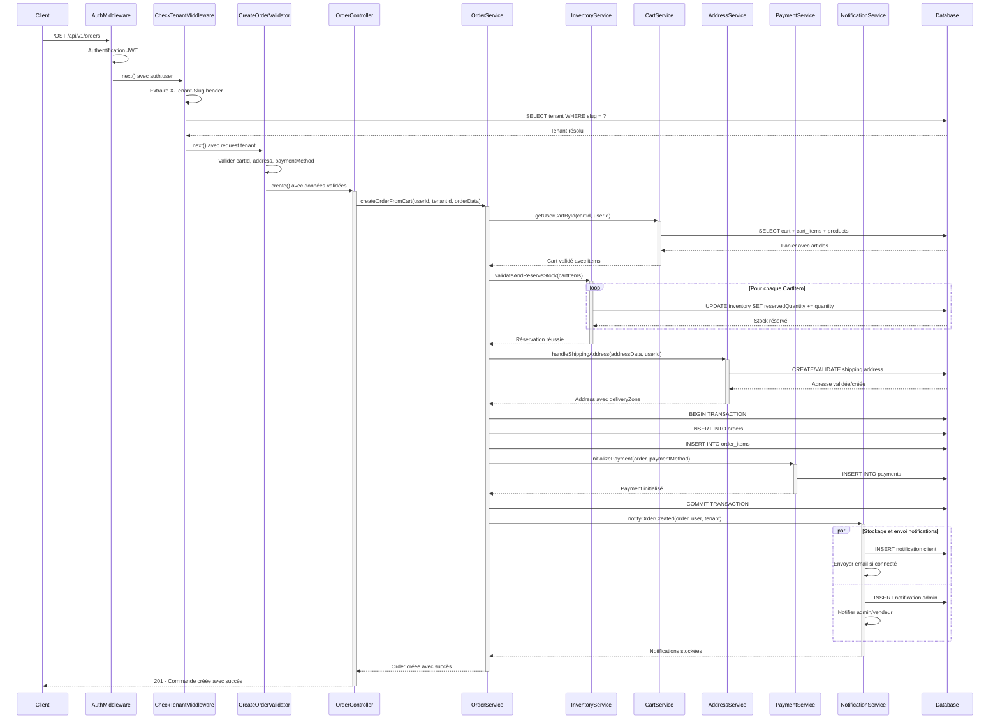
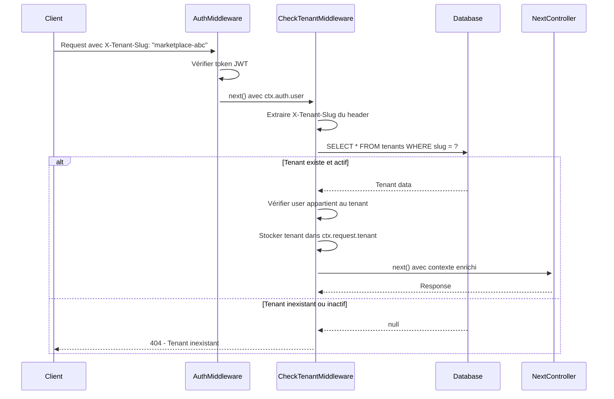
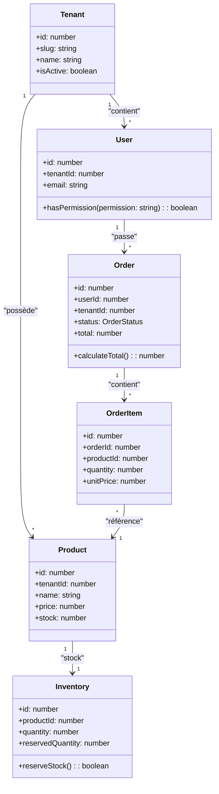

# CHAPITRE 3 : CONCEPTION ET ARCHITECTURE

## Introduction

Ce chapitre présente la conception technique de la plateforme e-commerce multi-tenant, traduisant les besoins identifiés en architecture logicielle. Il détaille les choix architecturaux effectués pour répondre aux contraintes d'isolation multi-tenant, de performance et d'évolutivité dans le contexte sénégalais. L'approche adoptée vise à concilier simplicité de déploiement, performance et évolutivité à travers une architecture modulith basée sur le Domain-Driven Design.

## 3.1 Architecture générale

### 3.1.1 Approche Modulith Multi-tenant

L'architecture de la plateforme adopte une approche **Modulith Multi-tenant** basée sur le Domain-Driven Design (DDD). Cette approche combine les avantages d'un déploiement monolithique avec la modularité des architectures distribuées.

**Principe de l'architecture Modulith :**

Cette architecture respecte le principe de **séparation des responsabilités** avec des modules autonomes organisés en bounded contexts :

- **Application unique** : Déploiement et maintenance simplifiés
- **Modules de domaine** : Séparation logique des préoccupations métier
- **Base de données partagée** : Cohérence transactionnelle garantie
- **Communication in-process** : Performance optimisée sans overhead réseau

### 3.1.2 Stratégie multi-tenant

La stratégie multi-tenant implémentée garantit l'isolation et la sécurité :

- **Shared Database, Shared Schema** : Approche pragmatique avec filtrage par `tenant_id`
- **Middleware de résolution** : Identification automatique du tenant via header `X-Tenant-Slug`
- **Isolation logique** : Toutes les requêtes filtrées automatiquement
- **Sécurité renforcée** : Validation de l'appartenance utilisateur-tenant

### 3.1.3 Architecture modulaire backend

L'architecture backend suit une approche DDD avec 12 modules autonomes encapsulant chacun sa logique métier spécifique.

#### Structure modulaire

## 3.2 Stack technologique

### 3.2.1 Technologies Frontend

**Angular 19 - Framework SPA moderne**

Angular 19 a été retenu pour ses avantages stratégiques :

- **Architecture composants** : Modularité et réutilisabilité maximales
- **TypeScript natif** : Sécurité du typage et maintenabilité accrue
- **Performances optimisées** : Lazy loading et tree shaking intégrés
- **Écosystème riche** : Angular Material, RxJS pour la réactivité
- **Multi-tenant ready** : Support des interceptors pour l'isolation tenant

**Tailwind CSS** apporte une approche utility-first avec design system cohérent et optimisation automatique.

### 3.2.2 Technologies Backend

**AdonisJS 6 - Framework Node.js TypeScript-first**

AdonisJS 6 constitue le cœur backend pour ses avantages distinctifs :

- **TypeScript natif** : Robustesse et cohérence avec le frontend
- **Architecture modulaire** : Support natif des modules de domaine
- **Lucid ORM** : Active Record avec migrations et relations sophistiquées
- **Multi-tenant support** : Middleware et scopes automatiques
- **Batteries included** : Authentification, validation, sécurité intégrés

**PostgreSQL** choisi pour ses performances, sa robustesse et son support JSON pour la flexibilité.

### 3.2.3 Justification des choix

**Cohérence TypeScript end-to-end**

L'utilisation de TypeScript sur l'ensemble du stack offre :

- Partage de types entre frontend et backend
- Détection d'erreurs à la compilation
- Productivité développeur et maintenance facilitée

**Maturité et performance**

Toutes les technologies sont éprouvées en production avec communautés actives et maintenance assurée.

## 3.3 Conception détaillée des fonctionnalités

### 3.3.1 Processus de commande multi-tenant

Le processus de commande constitue le cœur métier du système, orchestrant plusieurs modules avec gestion de l'isolation multi-tenant.

#### Diagramme de séquence - Création de commande

#### Analyse du processus

Ce diagramme illustre les caractéristiques architecturales clés :

1. **Sécurité multicouche** : Pipeline de middlewares (Auth → Tenant → Validation) garantissant la validation complète
2. **Isolation multi-tenant** : Résolution automatique du tenant avec contexte injecté
3. **Atomicité transactionnelle** : Transaction unique pour Order + OrderItems + Payment
4. **Gestion de stock préventive** : Réservation avant création pour éviter la survente
5. **Notifications fiables** : Pattern "persistence-first" stockant toutes les notifications en BD

### 3.3.2 Architecture de sécurité multi-tenant

#### Middleware de résolution de tenant

#### Système RBAC granulaire

L'architecture RBAC implémentée offre :

- **Rôles par tenant** : Isolation complète des autorisations
- **Permissions composées** : Format "action:resource" (ex: create:orders)
- **Validation dynamique** : Vérification à chaque requête
- **Héritage de rôles** : Support de hiérarchies complexes

### 3.3.3 Modèle de données multi-tenant

#### Diagramme de classes métier

Chaque entité métier inclut systématiquement le `tenantId` garantissant l'isolation des données.

## 3.4 Optimisations et performance

### 3.4.1 Optimisations base de données

- **Index composites** : Intégrant systématiquement tenant_id + clé métier
- **Requêtes optimisées** : Filtrage automatique par tenant via Lucid ORM
- **Connection pooling** : Gestion optimisée des connexions PostgreSQL

### 3.4.2 Optimisations frontend

- **Lazy loading** : Chargement à la demande des modules Angular
- **Tree shaking** : Élimination du code non utilisé
- **Bundle optimization** : Séparation vendor/app pour cache optimal

### 3.4.3 Architecture temps réel

**Socket.IO** intégré pour les notifications live :

- **Namespaces par tenant** : Isolation des événements temps réel
- **Room management** : Utilisateurs groupés par tenant et rôle
- **Event-driven** : Notifications automatiques lors des changements d'état

## 3.5 Évolutivité et maintenance

### 3.5.1 Architecture modulaire

La modularisation DDD facilite :

- **Maintenance isolée** : Modifications sans impact inter-modules
- **Tests unitaires** : Chaque module testable indépendamment
- **Évolution progressive** : Ajout de modules sans refactoring

### 3.5.2 Migration vers microservices

L'architecture modulith prépare une éventuelle évolution :

- **Bounded contexts** définis comme futurs microservices
- **Interfaces bien définies** facilitant l'extraction
- **Base de données partagée** décomposable par module

## Conclusion

L'architecture modulith multi-tenant proposée répond efficacement aux contraintes du contexte sénégalais. La combinaison Angular 19 + AdonisJS 6 + PostgreSQL garantit une solution robuste, performante et évolutive.

**Points clés de l'architecture :**

- **Isolation multi-tenant native** garantissant sécurité et séparation des données
- **Modularité DDD** facilitant maintenance et évolution
- **Performance optimisée** via index composites et requêtes tenant-aware
- **Sécurité multicouche** avec authentification, tenant et permissions
- **Développement solo efficace** grâce à la cohérence TypeScript end-to-end

Cette conception constitue une base solide pour l'implémentation d'une plateforme e-commerce adaptée aux spécificités du marché sénégalais, alliant simplicité opérationnelle et sophistication technique.
