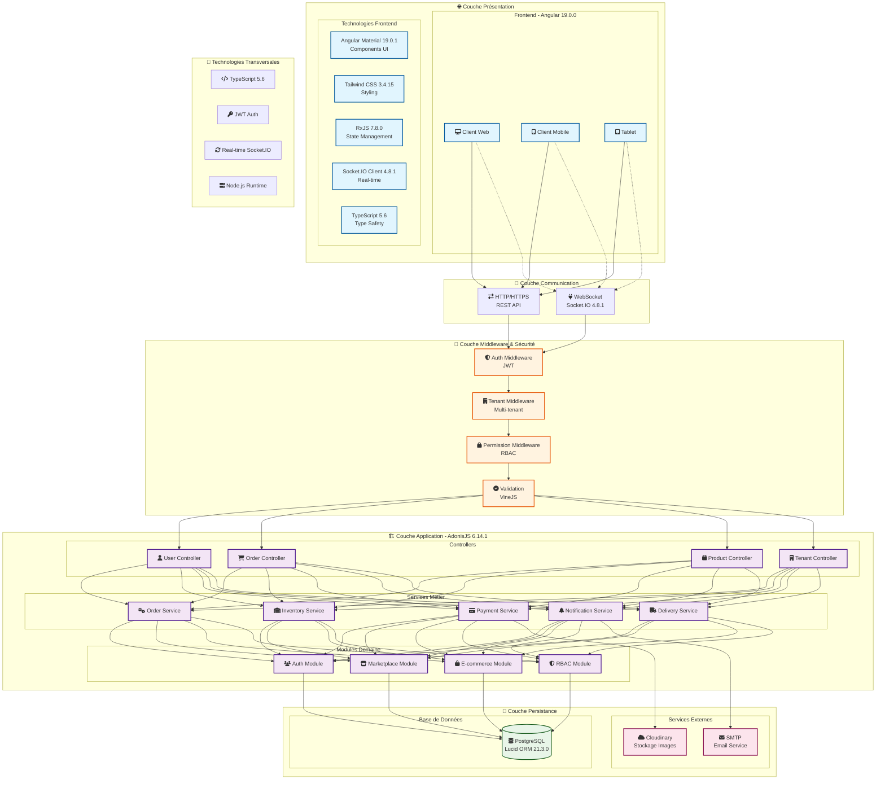

# Architecture Globale - Système E-commerce Multi-tenant

## Figure 3 : Architecture en couches avec stack technologique

Ce diagramme présente l'architecture globale du système e-commerce multi-tenant, organisée en couches avec les technologies et frameworks utilisés à chaque niveau. L'architecture suit le pattern en couches avec séparation claire des responsabilités entre présentation, logique métier, et persistance.

## Architecture Multi-tenant

### **Isolation des Données**
- **Tenant Resolution**: Header `X-Tenant-Slug` pour identification
- **Database Isolation**: Clé `tenant_id` sur toutes les entités
- **Context Injection**: Middleware enrichit le contexte avec tenant

### **Sécurité Multicouche**
- **Authentication**: JWT avec expiration 10h
- **Authorization**: RBAC avec permissions granulaires
- **Tenant Validation**: Vérification appartenance utilisateur-tenant
- **Input Validation**: VineJS pour validation des données

## Stack Technologique Principal

### **Frontend (Angular 19)**
- **Framework**: Angular 19.0.0 avec TypeScript
- **UI/UX**: Angular Material + Tailwind CSS
- **State**: RxJS pour programmation réactive
- **Real-time**: Socket.IO client pour notifications live

### **Backend (AdonisJS 6)**
- **Framework**: AdonisJS 6.14.1 sur Node.js
- **ORM**: Lucid ORM avec migrations
- **Authentication**: JWT + RBAC custom
- **Real-time**: Socket.IO serveur intégré

### **Base de Données**
- **SGBD**: PostgreSQL avec driver pg
- **Schema**: Multi-tenant avec isolation par tenant_id
- **Migrations**: Versioning schema automatisé

### **Services Externes**
- **Stockage**: Cloudinary pour images/fichiers
- **Email**: SMTP pour notifications
- **Real-time**: WebSocket pour mises à jour live

## Avantages Architecturaux

- **Scalabilité**: Architecture modulaire et multi-tenant
- **Maintenabilité**: Séparation claire des responsabilités
- **Sécurité**: Validation multicouche et isolation tenant
- **Performance**: Real-time avec Socket.IO, ORM optimisé
- **Flexibilité**: Stack moderne avec TypeScript end-to-end