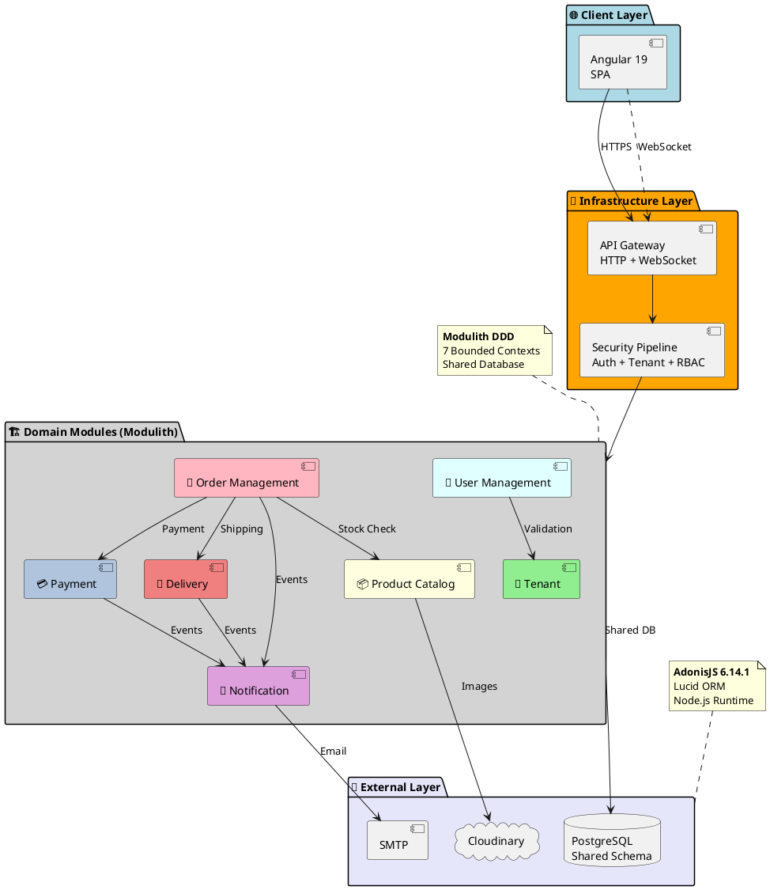
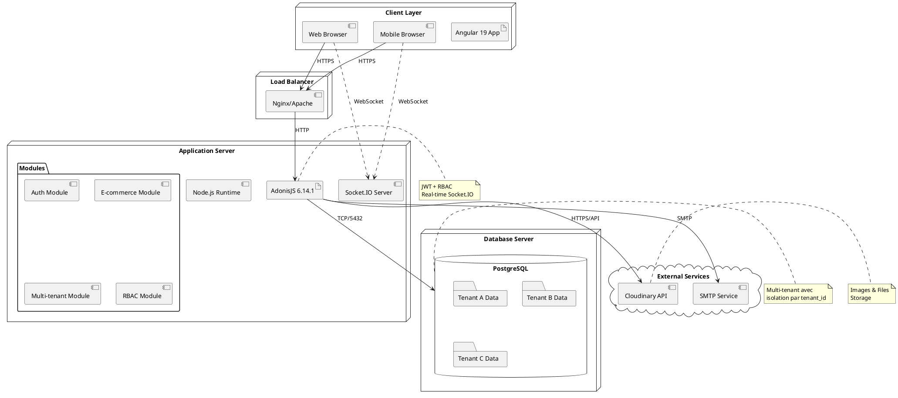
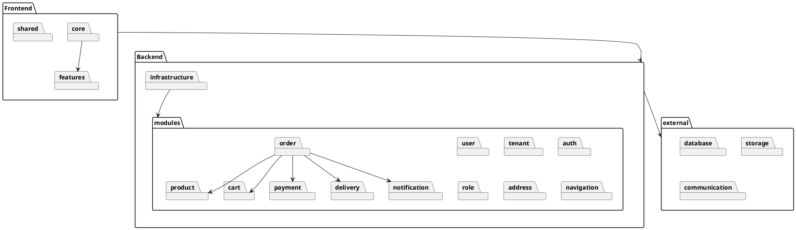

# Architecture Globale - PlantUML

## Figure 3b : Architecture DDD Modulith Multi-tenant (PlantUML)

## Type d'Architecture : Modulith Multi-tenant avec DDD

Cette architecture représente une **Architecture Modulith Multi-tenant basée sur Domain-Driven Design (DDD)**, combinant plusieurs patterns architecturaux modernes :

### **🏗️ Architecture Modulith (Modular Monolith)**

- **Monolithe modulaire** : Application unique avec modules autonomes
- **Bounded Contexts** : Chaque module représente un domaine métier isolé
- **Déploiement unifié** : Tous les modules dans une seule application
- **Communication in-process** : Appels directs entre modules sans overhead réseau

### **🌐 Multi-tenancy Pattern**

- **Tenant-per-Schema logique** : Isolation via `tenant_id` dans toutes les entités
- **Résolution dynamique** : Header `X-Tenant-Slug` pour identification du tenant
- **Contexte sécurisé** : Middleware inject le contexte tenant dans chaque requête
- **Isolation des données** : Garantie de séparation stricte entre locataires

### **📐 Domain-Driven Design (DDD)**

- **Ubiquitous Language** : Vocabulaire métier partagé par module
- **Bounded Contexts** : 7 contextes bornés (User, Tenant, Product, Order, Payment, Delivery, Notification)
- **Domain Models** : Entités riches avec logique métier encapsulée
- **Anti-corruption Layer** : Interfaces entre modules pour éviter le couplage

### **🔄 Event-Driven Communication**

- **Domain Events** : Communication asynchrone entre modules
- **Event Sourcing partiel** : Traçabilité des événements métier
- **Saga Pattern** : Orchestration des transactions inter-modules
- **Eventual Consistency** : Cohérence différée entre contextes

Ce diagramme illustre comment chaque module fonctionne comme un mini-monolithe autonome avec sa propre logique métier, ses modèles et sa persistance, tout en communiquant avec les autres modules via des interfaces bien définies.

## Principes DDD Modulith Respectés

### **Bounded Contexts (Contextes Bornés)**

- **User Management** : Authentification, autorisation, gestion des utilisateurs
- **Tenant Module** : Multi-tenancy, configuration tenant, isolation
- **Product Catalog** : Catalogue produits, catégories, inventaire
- **Order Management** : Commandes, panier, cycle de vie des commandes
- **Payment** : Traitement des paiements, transactions, facturation
- **Delivery** : Logistique, adresses, zones de livraison, suivi
- **Notification** : Notifications multi-canal, événements système

### **Communication Inter-Modules**

- **Interfaces bien définies** : Chaque module expose des services publics
- **Événements métier** : Communication asynchrone via événements
- **Base de données partagée** : Tous les modules accèdent à la même DB PostgreSQL
- **Couplage faible** : Modules indépendants au niveau logique mais pas données

### **Architecture Modulith**

- **Déploiement unique** : Tous les modules dans une seule application
- **Base de données partagée** : PostgreSQL unique avec schema partagé
- **Models = Tables** : Chaque model correspond directement à une table DB
- **Isolation logique** : Séparation par modules, pas par bases de données
- **Communication in-process** : Appels directs entre modules via services
- **Évolutivité** : Possibilité d'extraire en microservices si nécessaire

## Avantages de cette Architecture

### **🚀 Performance et Simplicité**

- **Latence minimale** : Communication in-process sans overhead réseau
- **ACID Transactions** : Transactions cross-modules simplifiées avec une seule DB
- **Débogage facile** : Stack trace complète sur une seule application
- **Déploiement simplifié** : Un seul artefact à déployer

### **🔧 Développement et Maintenance**

- **Développement rapide** : Refactoring facile entre modules
- **Tests intégrés** : Tests end-to-end dans un environnement unifié
- **Partage de code** : Utilities et infrastructure communes
- **Courbe d'apprentissage** : Plus simple qu'une architecture microservices

### **💰 Coûts et Infrastructure**

- **Infrastructure réduite** : Un seul serveur/container au lieu de plusieurs
- **Monitoring simplifié** : Un seul point de surveillance
- **Base de données unique** : Pas de complexité multi-DB
- **DevOps allégé** : Pipeline CI/CD simplifié

## Inconvénients et Limitations

### **⚠️ Scalabilité et Risques**

- **Scalabilité limitée** : Scaling horizontal de l'ensemble uniquement
- **Point de défaillance unique** : Panne de l'application = arrêt total
- **Coupling risqué** : Risque de dépendances cachées entre modules
- **Base de données bottleneck** : Une seule DB pour tous les modules

### **🔄 Évolution et Contraintes**

- **Déploiements monolithiques** : Impossible de déployer un module séparément
- **Technologies unifiées** : Stack technologique commune à tous les modules
- **Migration complexe** : Extraction future vers microservices nécessite refactoring
- **Scaling limité** : Montée en charge globale uniquement

## Diagramme de Déploiement PlantUML

## Architecture de Packages PlantUML

## Avantages de PlantUML

### **Standardisation**

- Syntaxe standardisée et portable
- Compatible avec la plupart des outils de documentation
- Versioning facile du code source

### **Flexibilité**

- Multiple types de diagrammes (déploiement, packages, composants)
- Personnalisation avancée des styles
- Export vers différents formats (PNG, SVG, PDF)

### **Intégration DevOps**

- Génération automatique dans CI/CD
- Intégration native avec GitLab, GitHub
- Documentation as Code

### **Maintenabilité**

- Code source textuel versionnable
- Modifications rapides et traçables
- Collaboration facilitée via Git

Ce format PlantUML offre une alternative professionnelle pour l'intégration dans des systèmes de documentation technique et des workflows DevOps.

## **Réalisation en Développement Solo**

### **🎯 Exploit Technique Remarquable**

Cette architecture modulith multi-tenant avec DDD, réalisée par un **développeur unique**, représente un accomplissement technique exceptionnel :

- **Maîtrise architecturale** : Conception et implémentation d'un système complexe multi-tenant
- **Vision globale** : Coordination de 7 modules de domaine interconnectés
- **Expertise technique** : Stack full-stack moderne (Angular 19 + AdonisJS 6 + PostgreSQL)
- **Qualité logicielle** : Respect des principes DDD, SOLID, et patterns modernes

### **🚀 Avantages du Développement Solo**

- **Cohérence totale** : Architecture unifiée sans compromis inter-équipes
- **Vélocité maximale** : Décisions rapides et implémentation directe
- **Connaissance complète** : Maîtrise de tous les aspects du système
- **Refactoring libre** : Évolutions architecturales sans négociation

### **📈 Prouesse d'Ingénierie**

Un système e-commerce multi-tenant complet avec :

- **7 bounded contexts** métier complexes
- **Architecture modulith** moderne et évolutive
- **Multi-tenancy** sécurisée avec isolation stricte
- **Real-time** via Socket.IO pour notifications live
- **RBAC granulaire** avec permissions par ressource

**Félicitations pour cette réalisation architecturale remarquable !**
