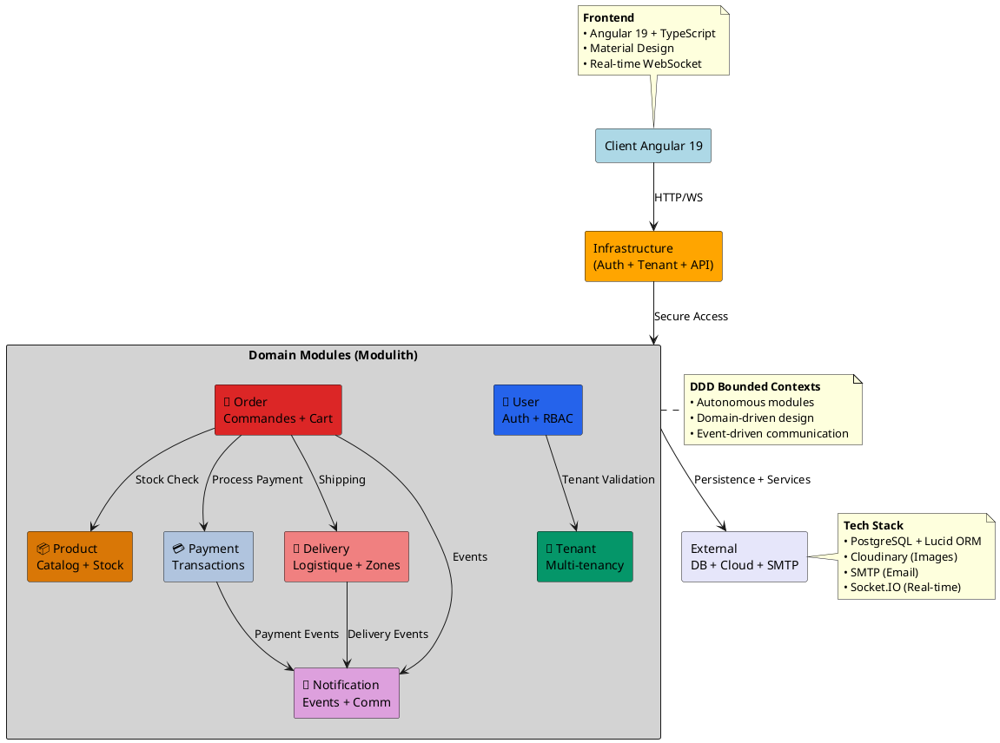
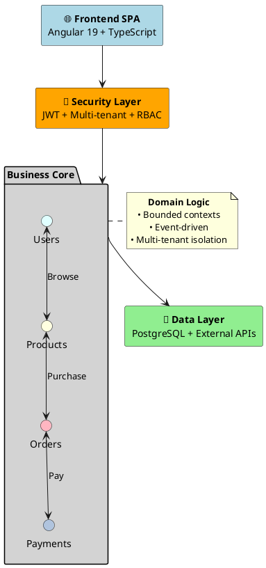
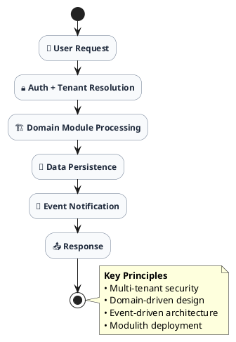

# Architecture Minimaliste - Système E-commerce Multi-tenant

## Figure 4 : Architecture DDD Modulith - Vue Simplifiée

Cette représentation minimaliste capture l'essence de l'architecture modulith multi-tenant en se concentrant sur les concepts fondamentaux : les domaines métier, leurs interactions, et l'infrastructure technique.



## Architecture C4 Model - Niveau Contexte

```plantuml
@startuml C4-Context-Level

!include https://raw.githubusercontent.com/plantuml-stdlib/C4-PlantUML/master/C4_Context.puml

LAYOUT_WITH_LEGEND()

title System Context - E-commerce Multi-tenant Platform

Person(customer, "Customer", "End user shopping on marketplace")
Person(vendor, "Vendor", "Tenant managing products/orders")  
Person(admin, "Platform Admin", "Super admin managing tenants")

System(ecommerce, "E-commerce Platform", "Multi-tenant marketplace with DDD modulith architecture")

System_Ext(cloudinary, "Cloudinary", "Image & file storage service")
System_Ext(smtp, "SMTP Server", "Email delivery service")
System_Ext(payment_gateway, "Payment Gateway", "External payment processing")

Rel(customer, ecommerce, "Browse, order products")
Rel(vendor, ecommerce, "Manage products, view orders")
Rel(admin, ecommerce, "Manage tenants, configure platform")

Rel(ecommerce, cloudinary, "Store/retrieve images")
Rel(ecommerce, smtp, "Send notifications")
Rel(ecommerce, payment_gateway, "Process payments")

@enduml
```

## Vue Fonctionnelle Simplifiée



## Diagramme de Flux Minimaliste



## Avantages de la Représentation Minimaliste

### **🎯 Clarté Conceptuelle**

- **Vision d'ensemble** : Architecture globale en un coup d'œil
- **Concepts essentiels** : Focus sur les éléments architecturaux clés
- **Communication efficace** : Compréhension rapide pour stakeholders

### **📐 Abstraction Appropriée**

- **Détails techniques cachés** : Concentration sur les patterns architecturaux
- **Relations importantes** : Inter-dépendances entre domaines mises en évidence
- **Évolutivité visible** : Possibilité d'extension claire

### **🔄 Utilisations Pratiques**

- **Présentation exécutive** : Vision stratégique de l'architecture
- **Onboarding équipe** : Compréhension rapide pour nouveaux développeurs
- **Documentation vivante** : Évolution facile avec le système
- **Décisions architecturales** : Support pour choix techniques futurs

Cette approche minimaliste révèle **l'élégance de votre conception** : une architecture complexe rendue compréhensible par sa structure logique et ses patterns bien définis.
