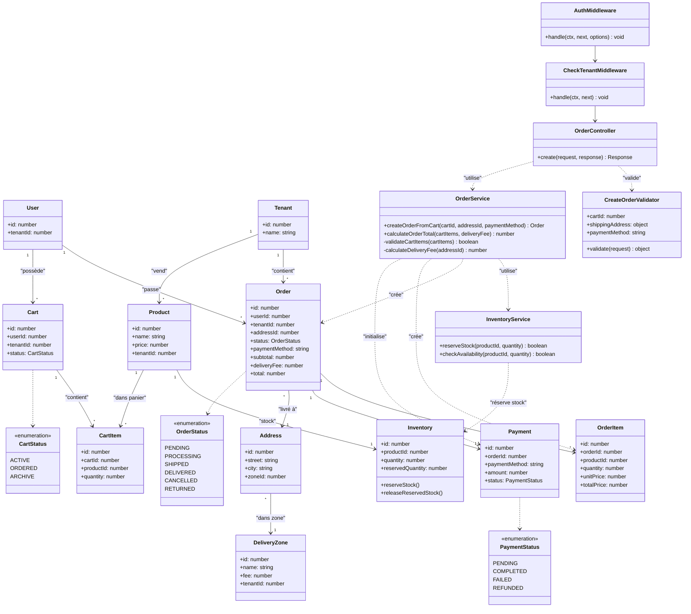

# Diagramme de Classes - Création de Commande (Create Order)

## Description du Flux de Création de Commande

### 1. **Authentification et Sécurité**

- **AuthMiddleware** : Authentification de l'utilisateur
- **CheckTenantMiddleware** : Résolution du **Tenant** multi-tenant
- **CreateOrderValidator** : Validation des données de commande

### 2. **Création de Commande**

- **User** authentifié transforme son **Cart** en **Order**
- **OrderService** coordonne la création avec validation métier
- **InventoryService** réserve le stock des **Products**

### 3. **Finalisation**

- Création des **OrderItems** pour chaque produit
- Calcul des frais de livraison via **DeliveryZone**
- Initialisation du **Payment** 
- Mise à jour du statut du **Cart**

Le diagramme simplifié se concentre sur les classes essentielles au processus de création de commande, éliminant les composants techniques non critiques tout en préservant la logique métier et la sécurité multi-tenant.
