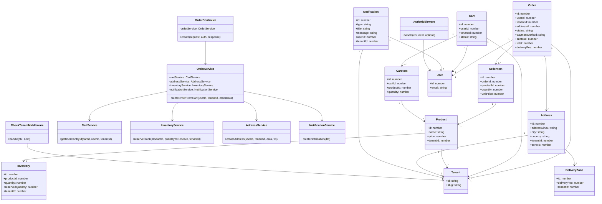

# Diagramme de Classes de Conception - Création de Commande

## Vue d'ensemble
Ce diagramme de classes de conception représente l'architecture des classes impliquées dans le processus de création de commande, basé sur l'implémentation AdonisJS du backend.

## Diagramme de Classes

## Responsabilités des Classes

### **Couche Middleware**
- **AuthMiddleware**: Authentification JWT des utilisateurs
- **CheckTenantMiddleware**: Résolution du contexte tenant via X-Tenant-Slug

### **Couche Contrôleur**
- **OrderController**: Gestion des requêtes HTTP pour les commandes

### **Couche Service (Logique Métier)**
- **OrderService**: Orchestrateur principal du processus de commande
- **CartService**: Gestion des paniers d'achat
- **InventoryService**: Gestion des stocks et réservations
- **AddressService**: Gestion des adresses de livraison
- **NotificationService**: Notifications utilisateur
- **NotificationRolesService**: Notifications basées sur les rôles

### **Couche Modèle (Persistance)**
- **Order/OrderItem**: Représentation des commandes
- **Cart/CartItem**: Représentation des paniers
- **Product/Inventory**: Gestion des produits et stocks
- **User/Tenant**: Entités multi-tenant
- **Address/DeliveryZone**: Gestion géographique
- **Notification**: Système de notifications

## Patterns de Conception Utilisés

1. **Dependency Injection**: Services injectés dans OrderService
2. **Repository Pattern**: Séparation modèles/services
3. **Multi-Tenant Pattern**: Isolation par tenantId 
4. **Transaction Script**: OrderService.createOrderFromCart()
5. **Observer Pattern**: Système de notifications
6. **Strategy Pattern**: Différents types de notifications

## Points Clés de l'Architecture

- **Séparation des responsabilités** entre middleware, contrôleurs et services
- **Architecture multi-tenant** avec isolation par tenant
- **Gestion transactionnelle** pour la cohérence des données  
- **Système de notifications dual** (utilisateur + rôles)
- **Gestion d'inventaire à 3 niveaux** (total, réservé, disponible)