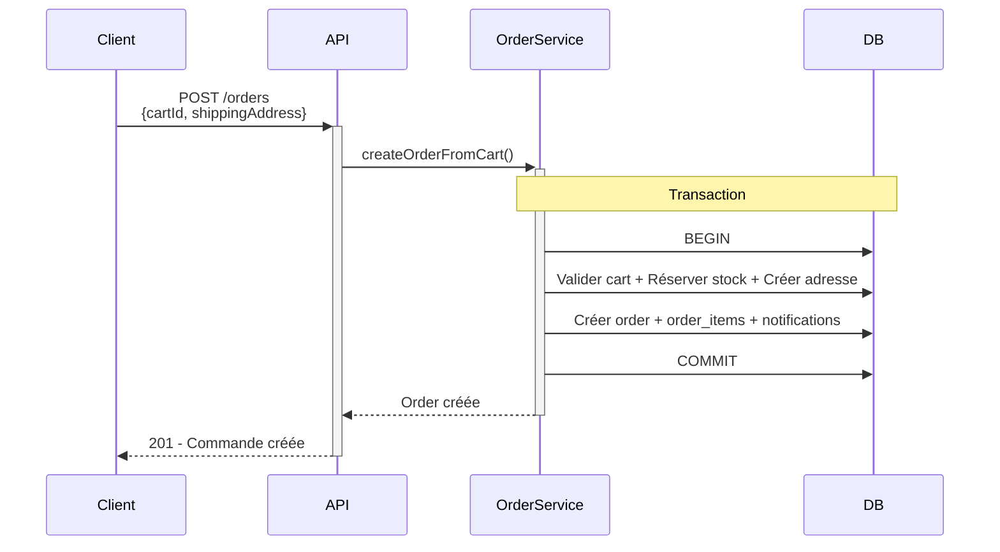

# Diagramme de Séquence Minimal - Création de Commande

## Vue d'ensemble
Version ultra-simplifiée du processus de création de commande, conservant l'essence de l'implémentation multi-tenant.

## Diagramme de Séquence

## Simplifications Maximales

1. **Regroupement des middlewares** - Auth + Tenant en un seul participant
2. **Fusion des services** - Cart, Inventory, Address regroupés 
3. **Optimisation des interactions DB** - Opérations groupées logiquement
4. **Réduction du pipeline** - Focus sur les étapes critiques
5. **Élimination des détails** - Conservation uniquement de l'essence

## Composants Essentiels Conservés

- **Pipeline d'authentification et tenant**
- **Validation des données d'entrée** 
- **Transaction atomique** pour la cohérence
- **Services métier critiques** (cart, stock, adresse)
- **Persistance de la commande**
- **Notifications**

Cette version ultra-réduite capture l'essence du processus tout en gardant la lisibilité maximale.