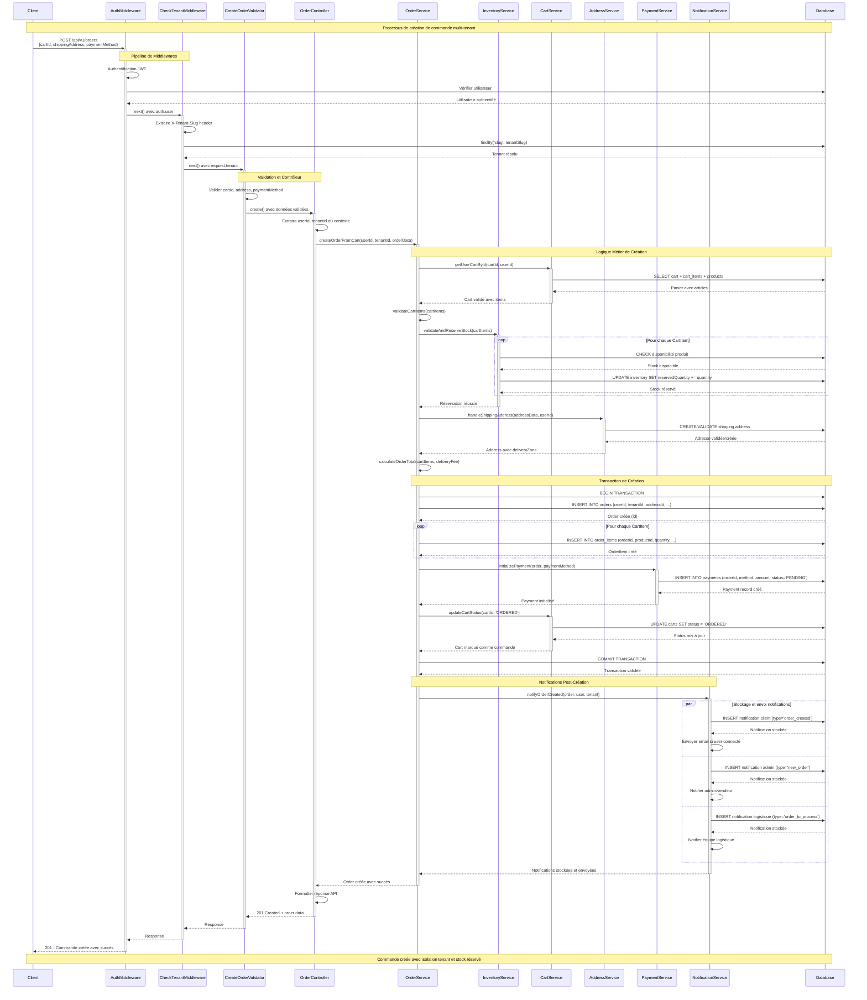

# Diagramme de Séquence - Création de Commande (Create Order)

Ce diagramme illustre le processus de création d'une commande e-commerce depuis la réception de la requête HTTP jusqu'à la réponse client. Le flux se décompose en cinq phases principales :

**Phase d'authentification et validation** : Les middlewares d'authentification et de tenant vérifient les droits d'accès et valident les données de la requête.

**Phase de traitement métier** : Le service orchestrateur récupère le panier, valide et réserve le stock via le service d'inventaire, puis traite l'adresse de livraison via le service d'adresse.

**Phase de persistance transactionnelle** : Une transaction garantit la cohérence lors de la création de la commande, de ses lignes, et du traitement du paiement via le service de paiement.

**Phase de notification** : Le système enregistre puis diffuse les notifications à tous les acteurs (client, admin, logistique) via des canaux multiples.

**Phase de réponse** : Le contrôleur formate la réponse API et la retourne via la chaîne de middlewares jusqu'au client avec le statut 201 Created.

L'architecture respecte le principe de séparation des responsabilités avec des services spécialisés orchestrés par le service principal OrderService.

## Description du Flux

### 1. **Pipeline de Sécurité**

- Authentification JWT de l'utilisateur
- Résolution du tenant via header `X-Tenant-Slug`
- Validation des données de commande

### 2. **Validation et Contrôle**

- Validation des paramètres (cartId, address, paymentMethod)
- Extraction du contexte utilisateur/tenant
- Délégation au service métier

### 3. **Logique Métier**

- Récupération et validation du panier
- Réservation du stock pour tous les produits
- Validation/création de l'adresse de livraison
- Calcul du total avec frais de livraison

### 4. **Transaction de Création**

- Transaction atomique pour créer Order + OrderItems
- Initialisation du Payment en statut PENDING
- Mise à jour du statut du Cart à "ORDERED"

### 5. **Notifications**

- **Stockage BD** : Toutes les notifications sont persistées pour traçabilité
- **Notifications parallèles** : Client, admin et logistique
- **Cohérence** : Users déconnectés reçoivent les notifications à la reconnexion
- **Multi-canal** : Email + notifications in-app

## Points Clés

- **Multi-tenant** : Isolation stricte par tenant
- **Atomicité** : Transaction pour garantir la cohérence
- **Réservation stock** : Évite la survente
- **Sécurité** : Authentification + validation à chaque étape
- **Notifications** : Stockage BD pour cohérence + communication multi-canal
