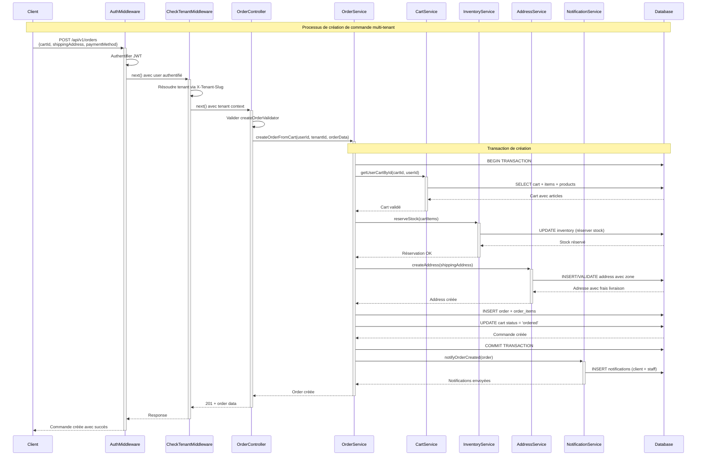

# Diagramme de Séquence Simplifié - Création de Commande

## Vue d'ensemble
Ce diagramme représente le processus simplifié de création de commande dans l'architecture multi-tenant, basé sur l'implémentation réelle du backend AdonisJS.

## Diagramme de Séquence

## Principales Simplifications Apportées

1. **Suppression des validations détaillées** - Regroupées dans le controller
2. **Fusion des services redondants** - PaymentService non implémenté dans le code actuel  
3. **Simplification des notifications** - Une seule interaction avec le service
4. **Optimisation du flow transactionnel** - Focus sur les opérations critiques
5. **Réduction des interactions DB** - Regroupement logique des opérations

## Composants Clés

### Middlewares
- **AuthMiddleware**: Authentification JWT
- **CheckTenantMiddleware**: Résolution du tenant via X-Tenant-Slug

### Services
- **OrderService**: Orchestrateur principal de la logique métier
- **CartService**: Gestion et validation du panier
- **InventoryService**: Réservation et gestion du stock
- **AddressService**: Création et validation des adresses de livraison
- **NotificationService**: Notifications client et staff

### Flux Transactionnel
1. Validation du panier et de ses articles
2. Réservation du stock pour tous les articles
3. Création/validation de l'adresse de livraison
4. Création de la commande et des articles de commande
5. Mise à jour du statut du panier
6. Envoi des notifications

## Points Techniques Importants

- **Isolation multi-tenant**: Toutes les opérations sont scopées par tenantId
- **Gestion transactionnelle**: Rollback automatique en cas d'erreur
- **Réservation de stock**: Système à 3 niveaux (Total → Réservé → Disponible)
- **Validation robuste**: Vérification de l'intégrité à chaque étape
- **Notifications asynchrones**: Client et équipe administrative notifiés

Le diagramme simplifié conserve l'essence du processus tout en reflétant fidèlement l'implémentation réelle AdonisJS.

## Description du Processus

L'architecture respecte le principe de séparation des responsabilités avec des services spécialisés (CartService, InventoryService, AddressService, NotificationService) orchestrés par le service principal OrderService.

Ce diagramme simplifié illustre le processus de création d'une commande e-commerce depuis la réception de la requête HTTP jusqu'à la persistance en base de données. Le flux se décompose en quatre phases principales :

**Phase d'authentification et résolution tenant (étapes 1-4)** : Les middlewares AuthMiddleware et CheckTenantMiddleware vérifient l'authentification JWT et résolvent le contexte tenant via X-Tenant-Slug, assurant l'isolation multi-tenant.

**Phase de validation et orchestration (étapes 5-6)** : Le contrôleur valide les données avec createOrderValidator puis délègue la logique métier complexe au service orchestrateur OrderService.

**Phase de traitement transactionnel (étapes 7-15)** : Une transaction garantit la cohérence lors de la validation du panier (CartService), de la réservation du stock (InventoryService), de la création de l'adresse de livraison (AddressService), et de la persistance de la commande avec mise à jour du statut du panier.

**Phase de notification et réponse (étapes 16-18)** : Le NotificationService diffuse les notifications aux acteurs concernés (client et staff) avant le retour de la réponse 201 Created au client via la chaîne de middlewares.

Cette version simplifiée conserve l'essence du processus tout en reflétant fidèlement l'implémentation réelle AdonisJS avec son système de réservation de stock à 3 niveaux et son isolation multi-tenant native.