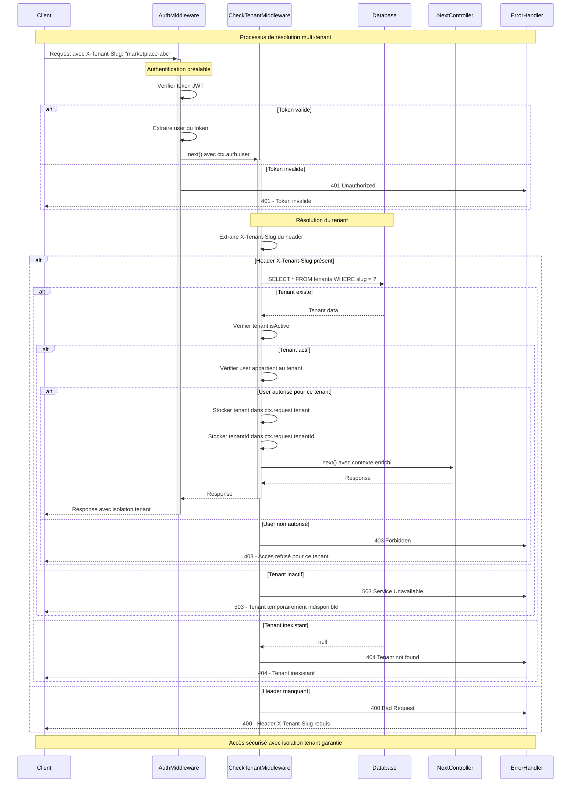

# Diagramme de Séquence - Middleware de Résolution de Tenant

## Figure 2 : Séquence de résolution multi-tenant avec validation sécurisée

Ce diagramme représente le processus de résolution et validation du tenant dans l'architecture multi-tenant. Le flux montre comment le système authentifie l'utilisateur, résout le tenant via le header `X-Tenant-Slug`, valide les contraintes d'appartenance, et enrichit le contexte de la requête avant de transmettre au contrôleur métier.

## Description du Processus

### **Phase d'authentification préalable**

- Vérification du token JWT par l'AuthMiddleware
- Extraction des informations utilisateur sequenceDiagram
    participant Client
    participant AuthMW as AuthMiddleware
    participant TenantMW as CheckTenantMiddleware
    participant DB as Database
    participant Controller as NextController
    participant ErrorHandler

    Note over Client,ErrorHandler: Processus de résolution multi-tenant

    Client->>+AuthMW: Request avec X-Tenant-Slug: "marketplace-abc"
    
    Note over AuthMW: Authentification préalable
    AuthMW->>AuthMW: Vérifier token JWT
    alt Token valide
        AuthMW->>AuthMW: Extraire user du token
        AuthMW->>+TenantMW: next() avec ctx.auth.user
    else Token invalide
        AuthMW->>ErrorHandler: 401 Unauthorized
        ErrorHandler-->>Client: 401 - Token invalide
    end

    Note over TenantMW,DB: Résolution du tenant
    TenantMW->>TenantMW: Extraire X-Tenant-Slug du header
    
    alt Header X-Tenant-Slug présent
        TenantMW->>DB: SELECT * FROM tenants WHERE slug = ?
        
        alt Tenant existe
            DB-->>TenantMW: Tenant data
            TenantMW->>TenantMW: Vérifier tenant.isActive
            
            alt Tenant actif
                TenantMW->>TenantMW: Vérifier user appartient au tenant
                
                alt User autorisé pour ce tenant
                    TenantMW->>TenantMW: Stocker tenant dans ctx.request.tenant
                    TenantMW->>TenantMW: Stocker tenantId dans ctx.request.tenantId
                    TenantMW->>+Controller: next() avec contexte enrichi
                    Controller-->>TenantMW: Response
                    TenantMW-->>-AuthMW: Response
                    AuthMW-->>-Client: Response avec isolation tenant
                else User non autorisé
                    TenantMW->>ErrorHandler: 403 Forbidden
                    ErrorHandler-->>Client: 403 - Accès refusé pour ce tenant
                end
            else Tenant inactif
                TenantMW->>ErrorHandler: 503 Service Unavailable
                ErrorHandler-->>Client: 503 - Tenant temporairement indisponible
            end
        else Tenant inexistant
            DB-->>TenantMW: null
            TenantMW->>ErrorHandler: 404 Tenant not found
            ErrorHandler-->>Client: 404 - Tenant inexistant
        end
        
    else Header manquant
        TenantMW->>ErrorHandler: 400 Bad Request
        ErrorHandler-->>Client: 400 - Header X-Tenant-Slug requis
    end

    Note over Client,ErrorHandler: Accès sécurisé avec isolation tenant garantiedu token
- Rejet immédiat si token invalide

### **Phase de résolution du tenant**

- Extraction du slug tenant depuis le header `X-Tenant-Slug`
- Requête directe en base de données pour récupérer le tenant
- Validation de l'existence du tenant

### **Phase de validation des contraintes**

- Vérification que le tenant est actif
- Contrôle d'appartenance de l'utilisateur au tenant
- Enrichissement du contexte avec les informations tenant

### **Phase d'enrichissement du contexte**

- Stockage du tenant dans `ctx.request.tenant`
- Stockage de l'ID tenant dans `ctx.request.tenantId`
- Transmission du contexte enrichi au contrôleur suivant

## Avantages de cette approche

- **Simplicité** : Accès direct à la base de données sans couche de cache
- **Sécurité** : Validation multicouche (token + tenant + appartenance)
- **Isolation** : Garantie que chaque requête opère dans le bon contexte tenant
- **Robustesse** : Gestion complète des cas d'erreur
- **Traçabilité** : Contexte tenant disponible pour logging et audit
