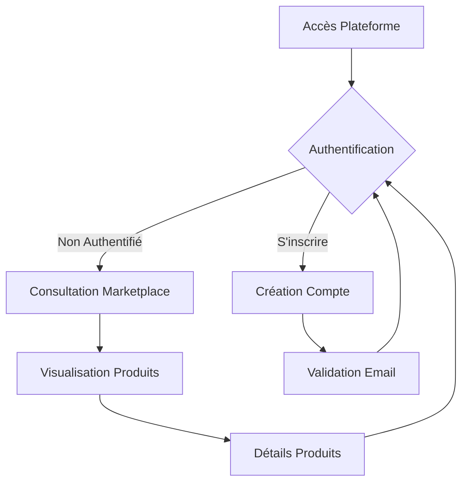
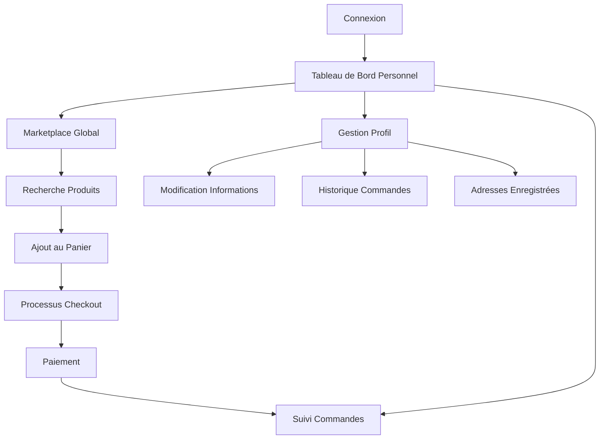
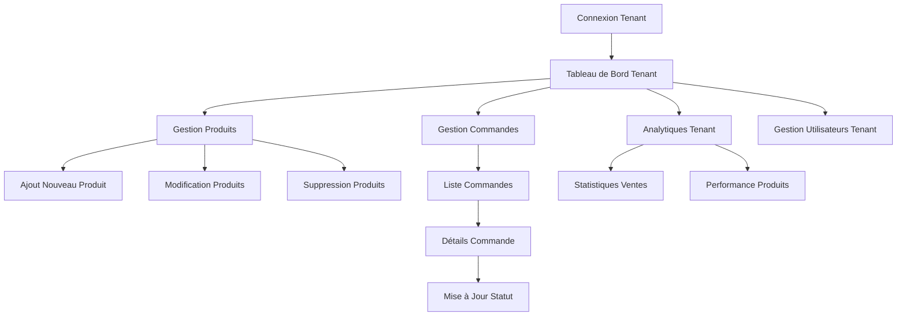
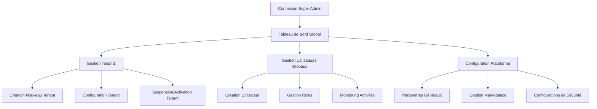
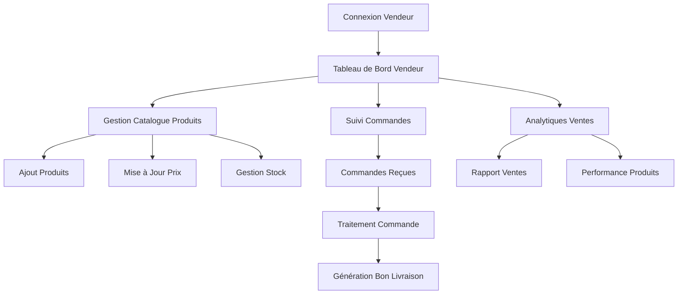

Les workflows pour les différents types d'utilisateurs dans cette plateforme e-commerce multitenante :

1. Utilisateur Anonyme / Visiteur

2. Utilisateur Client Standard

3. Administrateur de Tenant

4. Administrateur Système (Super Admin)

5. Vendeur sur Marketplace

Caractéristiques Transversales :

1. **Authentification Centralisée**
   - Authentification unique
   - Gestion des rôles
   - Protection des routes

2. **Multitenancy**
   - Isolation des données
   - Configurations spécifiques
   - Permissions granulaires

3. **Sécurité**
   - Authentification par token
   - Vérification des rôles
   - Protection contre les accès non autorisés

4. **Expérience Utilisateur**
   - Interface adaptative
   - Personnalisation selon le rôle
   - Parcours fluide

Flux Techniques Communs :
- Authentification JWT
- Intercepteurs HTTP
- Guards de routing
- Gestion d'états avec Signals
- Lazy loading

Points de Décision Clés :
- Séparation stricte des responsabilités
- Modèle de sécurité basé sur les rôles
- Flexibilité du système multi-tenant
- Performance et évolutivité

Technologies Supports :
- Angular 18
- RxJS
- NgRx (optional)
- Intercepteurs HTTP
- Guards de routing

Cette architecture permet une grande flexibilité tout en maintenant un niveau de sécurité et de contrôle élevé.

Voulez-vous que je développe un aspect spécifique de ces workflows ?