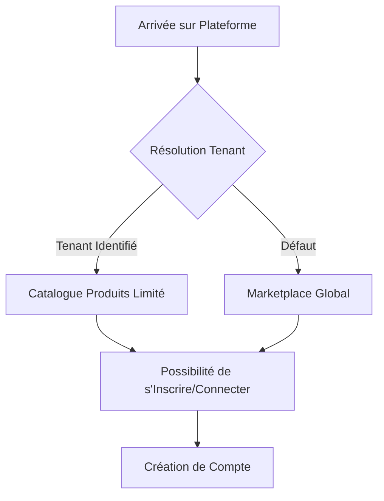
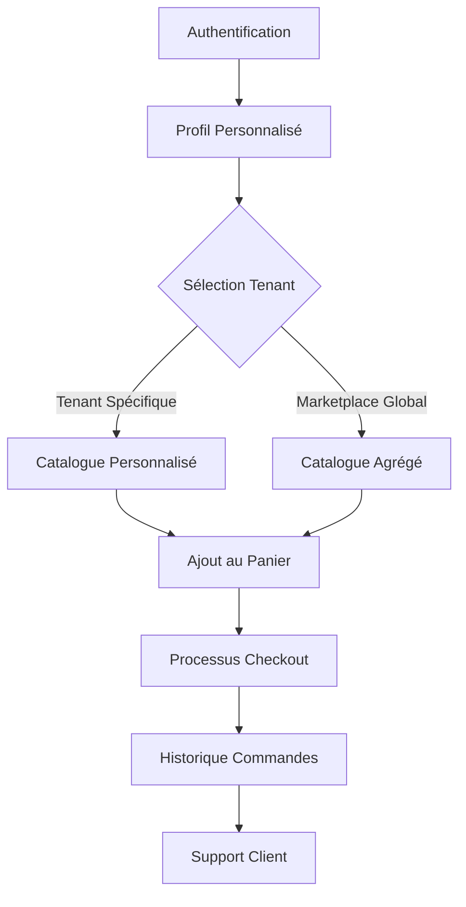
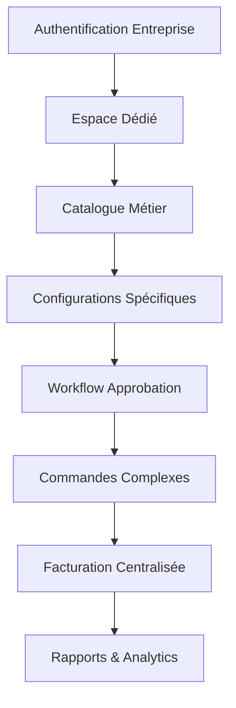
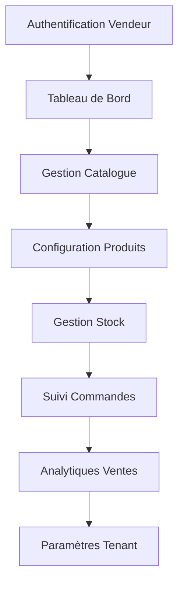
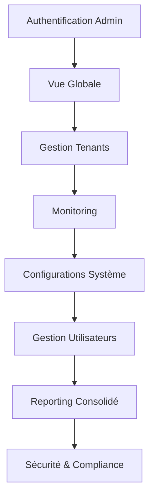
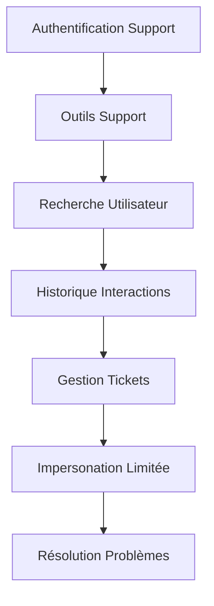

# Workflows pour Utilisateurs dans un Système E-commerce Multitenant

Je vais détailler les workflows pour différents types d'utilisateurs dans un système e-commerce multilocataire avec authentification basée sur les rôles.

🔐 Matrice des Types d'Utilisateurs

1. Visiteur Anonyme

-----------------------------
Workflow : Découverte Initiale



Capacités :

- Consulter le catalogue produits
- Visualiser les informations générales
- S'inscrire/Se connecter

2. Client Standard

-----------------------------
Workflow : Parcours Client



Capacités Supplémentaires :

- Commandes personnalisées
- Historique d'achats
- Gestion du profil
- Suivi des commandes

3. Client Entreprise / B2B

-----------------------------
Workflow : Compte Entreprise



Spécificités :

- Catalogues métier
- Workflow d'approbation
- Facturation personnalisée
- Reporting avancé

4. Vendeur / Tenant

-----------------------------
Workflow : Gestion Produits



Fonctionnalités :

- Gestion catalogue produits
- Suivi des ventes
- Configuration tenant
- Analytiques détaillées

5. Administrateur Plateforme

-----------------------------
Workflow : Supervision Globale



Pouvoirs Étendus :

- Gestion complète des tenants
- Supervision système
- Configurations globales
- Gestion des utilisateurs

6. Support Technique

-----------------------------
Workflow : Assistance



Capacités :

- Recherche utilisateurs
- Gestion tickets
- Impersonation limitée
- Résolution de problèmes

🔑 Principes Transverses

- Authentification multicouche
- Résolution dynamique du tenant
- Contrôle d'accès granulaire
- Personnalisation contextuelle

💡 Implémentation Technique

```typescript
enum UserRole {
  ANONYMOUS = 'anonymous',
  CLIENT = 'client',
  B2B_CLIENT = 'b2b_client',
  SELLER = 'seller',
  ADMIN = 'admin',
  SUPPORT = 'support'
}

interface UserWorkflowConfig {
  role: UserRole
  permissions: string[]
  tenantAccessLevel: 'none' | 'read' | 'write' | 'full'
}

class WorkflowOrchestrator {
  configureWorkflow(user: User): UserWorkflowConfig {
    switch(user.role) {
      case UserRole.ANONYMOUS:
        return this.anonymousWorkflow()
      case UserRole.CLIENT:
        return this.clientWorkflow(user)
      // Autres cas...
    }
  }
}
```

Points Critiques :

- Sécurité des accès
- Personnalisation contextuelle
- Performance de résolution
- Flexibilité du système

Recommandations :

- Conception modulaire
- Séparation claire des responsabilités
- Mécanismes de contrôle d'accès robustes
- Journalisation des actions

Cette approche offre une architecture flexible permettant de gérer efficacement les différents profils utilisateurs dans un système e-commerce multilocataire complexe.

Voulez-vous que je développe un aspect spécifique de ces workflows ?
